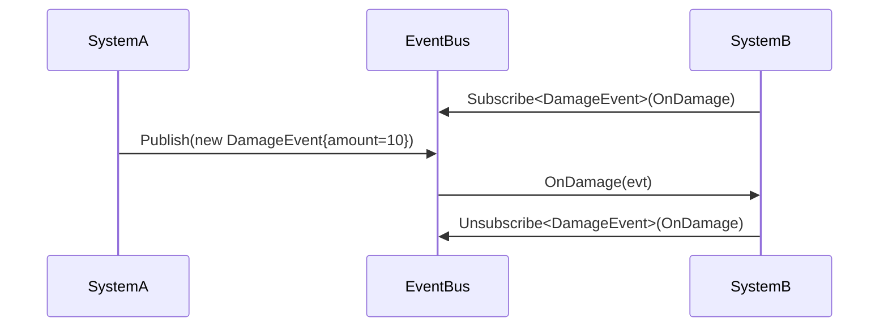

# RevCore.Foundation

RevCore.Foundation is the zero-dependency base package for RevCore. It provides contracts, event bus, logging, result types, common delegates, helpers, BigNumber, and SerializableDictionary.

## Install

Use Unity Package Manager with local path:

```text
Assets/RevCore/Foundation
```

Or add package by name when published to a registry:

```json
"com.rabear.revcore.foundation": "0.1.0"
```

## 60-second Quick Start

Create an event:

```csharp
using RevCore;

public readonly struct DamageEvent : IEvent
{
    public readonly int Amount;

    public DamageEvent(int amount)
    {
        Amount = amount;
    }
}
```

Subscribe and publish:

```csharp
using RevCore;

public sealed class DamagePresenter
{
    public void Enable()
    {
        Events.Subscribe<DamageEvent>(OnDamage);
    }

    public void Disable()
    {
        Events.Unsubscribe<DamageEvent>(OnDamage);
    }

    private void OnDamage(DamageEvent evt)
    {
        Log.Info($"Damage: {evt.Amount}");
    }
}

Events.Publish(new DamageEvent(10));
```

Return safe errors without exceptions:

```csharp
using RevCore;

public Result<int> GetLevel(string id)
{
    if (string.IsNullOrEmpty(id))
        return Result<int>.Fail("Level id is empty.");

    return Result<int>.Ok(1);
}
```

## Concepts

### EventBus

`IEventBus` is type-keyed pub/sub for structs or classes implementing `IEvent`. Use instance `EventBus` for scoped systems. Use static `Events` for simple global flows.

### Logger

`IRevLogger` abstracts logging. `RevLog` is default Unity `Debug` wrapper with log levels and tags.

### Result

`Result` and `Result<T>` represent success/failure without throwing exceptions for expected failures.

### Helpers

Helpers are curated from RCore and kept dependency-free. Foundation helpers cover math, time, color, transform, component, string, and collection utilities.

### BigNumber

`BigNumber` is a lightweight numeric type for formatted large values such as `1.5K`, `2M`, and `3B`.

### SerializableDictionary

`SerializableDictionary<TKey, TValue>` serializes dictionary entries through Unity `ISerializationCallbackReceiver` with O(n) sync.

## API Reference

### Events

| API | Purpose |
|---|---|
| `IEvent` | Marker interface for event payloads |
| `IEventBus.Subscribe<T>(Action<T>)` | Register listener for event type |
| `IEventBus.Unsubscribe<T>(Action<T>)` | Remove listener for event type |
| `IEventBus.Publish<T>(T)` | Notify all listeners for event type |
| `IEventBus.Clear()` | Remove all listeners |
| `IEventBus.Clear<T>()` | Remove listeners for one event type |
| `Events.Global` | Shared global event bus |

### Logging

| API | Purpose |
|---|---|
| `LogLevel` | Trace, Debug, Info, Warning, Error, Off |
| `IRevLogger.MinLevel` | Minimum emitted log level |
| `IRevLogger.Log(level, message, context)` | Write log entry |
| `IRevLogger.Log(level, tag, message, context)` | Write tagged log entry |
| `Log.Logger` | Active global logger |
| `Log.Info/Warn/Error` | Static convenience methods |

### Results

| API | Purpose |
|---|---|
| `Result.Ok()` | Success without payload |
| `Result.Fail(string)` | Failure without payload |
| `Result<T>.Ok(T)` | Success with payload |
| `Result<T>.Fail(string)` | Failure with message |
| `Result<T>.Value` | Get value or throw if error |
| `Result<T>.TryGetValue(out T)` | Safely read value |
| `Result<T>.ValueOr(T)` | Return value or fallback |

### Types

| API | Purpose |
|---|---|
| `BigNumber` | Store and format large numeric values |
| `SerializableDictionary<TKey,TValue>` | Unity-serializable dictionary |
| `SerializedDictionary<TKey,TValue>` | Serialized key/value entry |

## Event Flow Diagram



## Common Use Cases

### Scoped event bus per feature

```csharp
var battleBus = new EventBus();
battleBus.Subscribe<DamageEvent>(evt => Log.Info(evt.Amount.ToString()));
battleBus.Publish(new DamageEvent(5));
battleBus.Clear();
```

### Log filtering

```csharp
Log.Logger.MinLevel = LogLevel.Warning;
Log.Info("Hidden");
Log.Warn("Shown");
```

### Dictionary serialization

```csharp
using RevCore;
using UnityEngine;

public sealed class RewardTable : ScriptableObject
{
    [SerializeField] private SerializableDictionary<string, int> rewards = new();
}
```

## Extension Points

### Custom IEventBus

Implement `IEventBus` when a feature needs tracing, async dispatch, or thread handoff.

```csharp
public sealed class TracedEventBus : IEventBus
{
    private readonly EventBus m_inner = new();

    public int ListenerCount => m_inner.ListenerCount;
    public void Subscribe<T>(System.Action<T> listener) where T : IEvent => m_inner.Subscribe(listener);
    public void Unsubscribe<T>(System.Action<T> listener) where T : IEvent => m_inner.Unsubscribe(listener);
    public void Publish<T>(T evt) where T : IEvent
    {
        Log.Logger.Log(LogLevel.Debug, $"Publish {typeof(T).Name}");
        m_inner.Publish(evt);
    }
    public void Clear() => m_inner.Clear();
    public void Clear<T>() where T : IEvent => m_inner.Clear<T>();
}
```

### Custom IRevLogger

Assign `Log.Logger` to redirect logs to another sink.

```csharp
public sealed class SilentLogger : IRevLogger
{
    public LogLevel MinLevel { get; set; } = LogLevel.Off;
    public void Log(LogLevel level, string message, UnityEngine.Object context = null) { }
    public void Log(LogLevel level, string tag, string message, UnityEngine.Object context = null) { }
}

Log.Logger = new SilentLogger();
```

## Migration from RCore

| RCore pattern | RevCore.Foundation replacement |
|---|---|
| Static utility calls mixed across `RUtil` | Focused helpers under `RevCore` namespace |
| Event logic coupled to caller code | `IEventBus` or `Events` |
| Direct `Debug.Log` everywhere | `IRevLogger` or `Log` |
| Exceptions for expected failures | `Result<T>` |
| RCore `BigNumberD` | RevCore `BigNumber` for lightweight formatted numbers |
| RCore `SerializableDictionary` | RevCore `SerializableDictionary` without Newtonsoft dependency |

RevCore.Foundation does not depend on RCore. Existing RCore projects can keep using RCore while new features adopt RevCore package by package.

## Troubleshooting

| Problem | Fix |
|---|---|
| Event listener called twice | Ensure same handler is not subscribed from multiple object instances |
| Event listener still called after object disabled | Call `Unsubscribe<T>` from disable/dispose path |
| No logs appear | Check `Log.Logger.MinLevel` is not above emitted level |
| `Result<T>.Value` throws | Check `IsOk` or use `TryGetValue` before reading `Value` |
| SerializableDictionary loses item | Check key is not null and key values are unique |
| Package not visible in Package Manager | Add package by local path `Assets/RevCore/Foundation` |

## Safety Notes

- No dependency on `Assets/RCore/`.
- No MonoBehaviour required for core APIs.
- Runtime asmdef is auto-referenced for easy use.
- Editor asmdef is Editor-only and not included in player builds.
