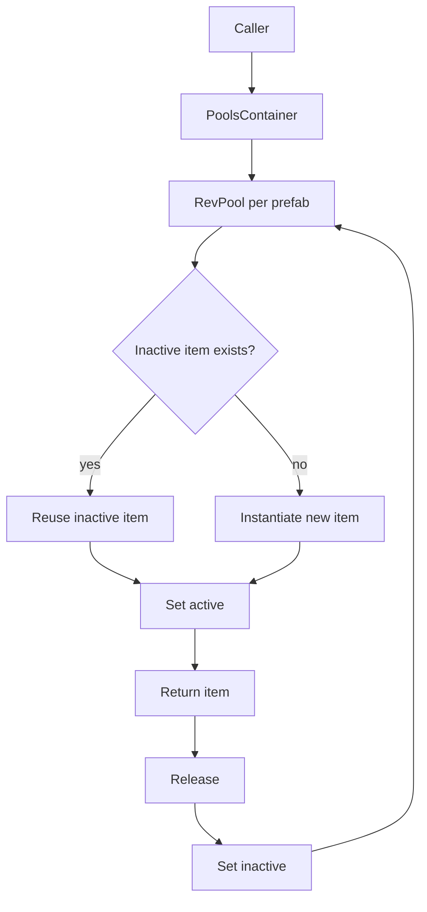

# RevCore.Pool

Reusable Component and GameObject pooling for RevCore.

## Install

Unity Package Manager, local path:

```text
Assets/RevCore/Pool
```

Or by name when published:

```json
"com.rabear.revcore.pool": "0.1.0"
```

Requires:

```json
"com.rabear.revcore.foundation": "0.1.0",
"com.rabear.revcore.timer": "0.1.0"
```

## 60-second Quick Start

```csharp
using UnityEngine;
using RevCore;

public class BulletSpawner : MonoBehaviour
{
    [SerializeField] private PoolObject bulletPrefab;
    private PoolsContainer<PoolObject> pools;

    private void Awake()
    {
        pools = new PoolsContainer<PoolObject>("BulletPools", 10, transform);
    }

    public void Fire(Vector3 position)
    {
        var bullet = pools.Spawn(bulletPrefab, position);
        pools.Get(bulletPrefab).Release(bullet, 2f);
    }
}
```

## Concepts

### RevPool

`RevPool<T>` manages one prefab type.

```csharp
var pool = new RevPool<PoolObject>(prefab, 10, transform);
var item = pool.Spawn();
pool.Release(item);
```

### PoolsContainer

`PoolsContainer<T>` creates one pool per prefab and tracks spawned clones.

```csharp
var pools = new PoolsContainer<PoolObject>("Pools", 5);
var item = pools.Spawn(enemyPrefab);
pools.Release(item);
```

### Delayed release

Delayed release uses RevCore.Timer.

```csharp
pool.Release(item, 1.5f);
```

## Flow



## API Reference

| Type | Purpose |
|---|---|
| `IPool<T>` | Pool contract |
| `IPoolContainer<T>` | Pool container contract |
| `RevPool<T>` | Pool for one Component prefab |
| `PoolsContainer<T>` | Multi-prefab pool manager |
| `PoolObject` | Optional marker component for pooled GameObjects |
| `RevPoolDebugDrawer` | Editor-only debug UI helper |

## Migration from RCore

| RCore | RevCore.Pool |
|---|---|
| `CustomPool<T>` | `RevPool<T>` |
| `PoolsContainer<T>` | `PoolsContainer<T>` |
| `pool.limitNumber` | `pool.LimitNumber` |
| `pool.onSpawn` | `pool.OnSpawn` |
| `TimerEventsInScene` delayed release | `Timers.WaitForSeconds` via `pool.Release(item, delay)` |
| `DrawOnEditor()` inside runtime | `RevPoolDebugDrawer.Draw()` in Editor asmdef |

## Safety Notes

- RevCore.Pool does not modify RCore pools.
- Runtime has no `UnityEditor` dependency.
- Delayed release requires RevCore.Timer to tick via `Timers.Tick` or `GlobalTimers.Instance`.
- Destroy methods use `DestroyImmediate` outside Play Mode and `Destroy` in Play Mode.
