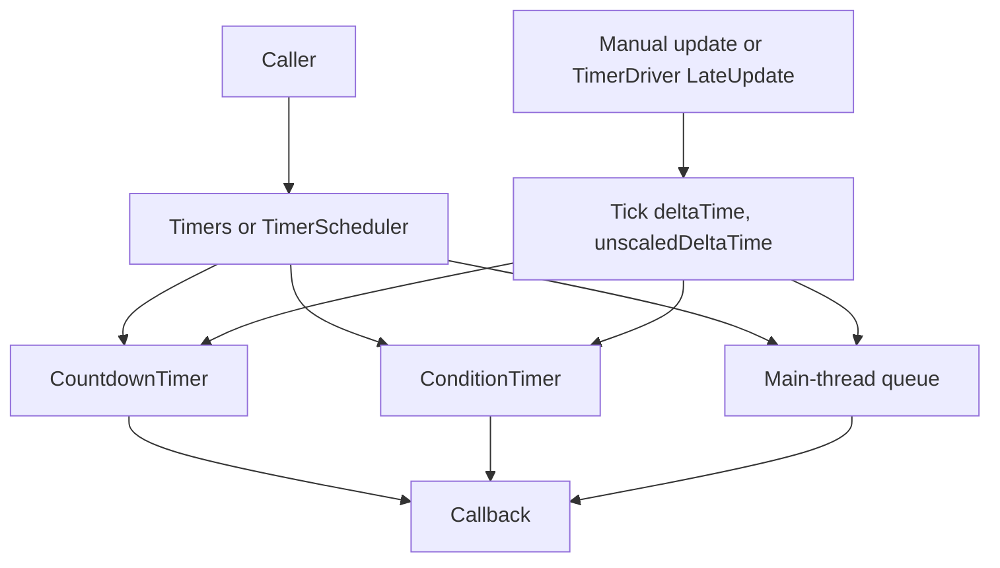

# RevCore.Timer

Manual and Unity-driven timer scheduling for RevCore.

## Install

Unity Package Manager, local path:

```text
Assets/RevCore/Timer
```

Or by name when published:

```json
"com.rabear.revcore.timer": "0.1.0"
```

Requires:

```json
"com.rabear.revcore.foundation": "0.1.0"
```

## 60-second Quick Start

```csharp
using RevCore;

public class WaveSystem
{
    public void StartWave()
    {
        Timers.WaitForSeconds(3f, SpawnWave);
    }

    private void SpawnWave()
    {
        Log.Info("Spawn wave");
    }
}
```

If you do not use `GlobalTimers.Instance`, call `Timers.Tick(deltaTime, unscaledDeltaTime)` from your own update loop.

```csharp
Timers.Tick(Time.deltaTime, Time.unscaledDeltaTime);
```

## Concepts

### Manual scheduler

`TimerScheduler` is plain C#. It does not inherit MonoBehaviour and does not read `UnityEngine.Time`.

```csharp
var scheduler = new TimerScheduler();
scheduler.WaitForSeconds(1f, () => Log.Info("Done"));
scheduler.Tick(deltaTime, unscaledDeltaTime);
```

### Static facade

`Timers` owns a replaceable global scheduler.

```csharp
Timers.Scheduler = new TimerScheduler();
Timers.WaitForSeconds(1f, OnDone);
Timers.Tick(Time.deltaTime, Time.unscaledDeltaTime);
```

### Unity drivers

`GlobalTimers.Instance` creates a hidden persistent driver. `SceneTimers.Instance` creates a scene-lifetime driver.

```csharp
GlobalTimers.Instance.WaitForSeconds(2f, OnDone);
SceneTimers.Instance.WaitForCondition(() => ready, OnReady);
```

## API Reference

| Type | Purpose |
|---|---|
| `ITimerHandle` | Cancel and inspect one timer |
| `ITimerScheduler` | Scheduler contract |
| `TimedAction` | Small manually updated one-shot timer |
| `TimerScheduler` | Plain C# countdown/condition/event scheduler |
| `Timers` | Static facade over replaceable scheduler |
| `TimerDriver` | Optional MonoBehaviour driver |
| `GlobalTimers` | Persistent global Unity driver |
| `SceneTimers` | Scene-lifetime Unity driver |

## Flow



## Common Use Cases

### Delayed callback

```csharp
Timers.WaitForSeconds(0.5f, () => panel.Hide());
```

### Unscaled UI timer

```csharp
Timers.WaitForSeconds(1f, OnPopupDone, unscaledTime: true);
```

### Wait for condition

```csharp
Timers.WaitForCondition(() => inventory.IsLoaded, RefreshInventory);
```

### Debounce event publish

```csharp
public struct InventoryChangedEvent : IEvent { }
Timers.Debounce(new InventoryChangedEvent(), 0.2f);
```

### Cancel handle

```csharp
ITimerHandle handle = Timers.WaitForSeconds(3f, OnTimeout);
handle.Cancel();
```

## Migration from RCore

| RCore | RevCore.Timer |
|---|---|
| `TimerEventsGlobal.Instance.WaitForSeconds(1f, action)` | `GlobalTimers.Instance.WaitForSeconds(1f, action)` |
| `TimerEventsInScene.Instance.WaitForCondition(condition, action)` | `SceneTimers.Instance.WaitForCondition(condition, action)` |
| `CountdownEvent` | `ITimerHandle` + `TimerScheduler.WaitForSeconds` |
| `DelayableEvent` + `EventDispatcher.Raise` | `Timers.Debounce(new MyEvent(), seconds)` |
| MonoBehaviour-only ticking | Manual `TimerScheduler.Tick` or optional `TimerDriver` |

## Safety Notes

- `TimerScheduler` is not a Unity object and can be unit-tested without scenes.
- `GlobalTimers` creates a hidden persistent GameObject like RCore global timer.
- `SceneTimers` is destroyed on scene load.
- Timers do not run unless some code calls `Tick`, or a Unity driver is active.
