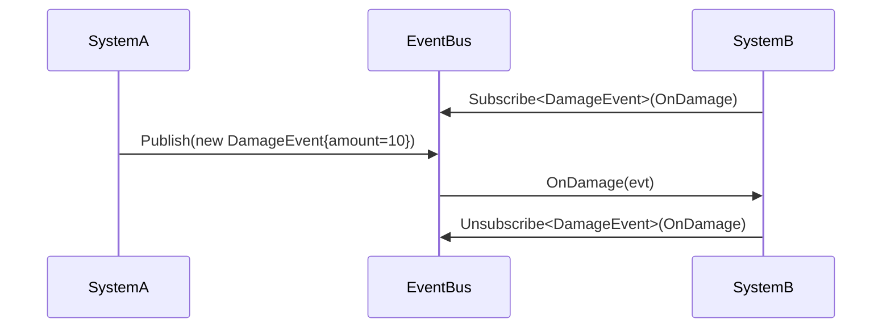

# RevCore.Foundation Implementation Plan

> **For agentic workers:** REQUIRED SUB-SKILL: Use superpowers:subagent-driven-development (recommended) or superpowers:executing-plans to implement this plan task-by-task. Steps use checkbox (`- [ ]`) syntax for tracking.

**Goal:** Build RevCore.Foundation — the zero-dependency core package providing contracts, event bus, result types, logging, and utility helpers that all other RevCore packages depend on.

**Architecture:** Pure C# + UnityEngine only. No MonoBehaviour required for core APIs (event bus, logger, results). Provide optional MonoBehaviour convenience where useful. Interface-first: every public system has a contract interface and a default implementation. Static facades wrap interfaces for convenience but are never required.

**Tech Stack:** Unity 2022.3, C#, EditMode tests, asmdef isolation.

---

## File Structure

```
Assets/RevCore/Foundation/
  package.json
  README.md
  CHANGELOG.md
  Runtime/
    RevCore.Foundation.Runtime.asmdef
    Contracts/
      IEventBus.cs              ← Event bus interface
      ILogger.cs                ← Logger interface
    Events/
      EventBus.cs               ← Default IEventBus (type-keyed, thread-aware)
      IEvent.cs                 ← Marker interface for events
    Logging/
      RevLog.cs                 ← Default ILogger (wraps UnityEngine.Debug)
      LogLevel.cs               ← Enum: Trace/Debug/Info/Warning/Error
    Results/
      Result.cs                 ← Result<T> type for error handling without exceptions
    Helpers/
      MathHelper.cs             ← Ported math extensions from RCore
      TimeHelper.cs             ← Ported time extensions
      ColorHelper.cs            ← Ported color extensions
      TransformHelper.cs        ← Ported transform extensions
      ComponentHelper.cs        ← Ported component extensions
      StringHelper.cs           ← Ported string extensions from RUtil
      CollectionHelper.cs       ← Ported list/array extensions from RUtil
    Types/
      BigNumber.cs              ← Ported BigNumberD with fixes
      SerializableDictionary.cs ← Ported with perf fixes
    Delegates.cs                ← Common delegate types
  Editor/
    RevCore.Foundation.Editor.asmdef
  Tests/
    Runtime/
      RevCore.Foundation.Tests.asmdef
      EventBusTests.cs
      ResultTests.cs
      BigNumberTests.cs
  Samples~/
    EventBusSample/
      EventBusSample.cs
```

---

## Task 1: Package scaffold

**Files:**
- Create: `Assets/RevCore/Foundation/package.json`
- Create: `Assets/RevCore/Foundation/Runtime/RevCore.Foundation.Runtime.asmdef`
- Create: `Assets/RevCore/Foundation/Editor/RevCore.Foundation.Editor.asmdef`
- Create: `Assets/RevCore/Foundation/Tests/Runtime/RevCore.Foundation.Tests.asmdef`
- Create: `Assets/RevCore/Foundation/CHANGELOG.md`
- Remove: `Assets/RevCore/Main/` (scaffold placeholder — replaced by Foundation as first real package)

- [ ] **Step 1: Create package.json**

```json
{
  "name": "com.rabear.revcore.foundation",
  "version": "0.1.0",
  "displayName": "RevCore.Foundation",
  "description": "Core contracts, event bus, logging, result types, and utility helpers for the RevCore framework.",
  "unity": "2022.3",
  "documentationUrl": "https://github.com/hnb-rabear/RCore",
  "author": {
    "name": "HNB RaBear",
    "email": "nbhung71711@gmail.com",
    "url": "https://github.com/hnb-rabear"
  },
  "keywords": ["framework", "foundation", "events", "utility"],
  "dependencies": {}
}
```

- [ ] **Step 2: Create runtime asmdef**

```json
{
  "name": "RevCore.Foundation.Runtime",
  "rootNamespace": "RevCore",
  "references": [],
  "includePlatforms": [],
  "excludePlatforms": [],
  "allowUnsafeCode": false,
  "overrideReferences": false,
  "precompiledReferences": [],
  "autoReferenced": true,
  "defineConstraints": [],
  "versionDefines": [],
  "noEngineReferences": false
}
```

- [ ] **Step 3: Create editor asmdef**

```json
{
  "name": "RevCore.Foundation.Editor",
  "rootNamespace": "RevCore.Editor",
  "references": ["RevCore.Foundation.Runtime"],
  "includePlatforms": ["Editor"],
  "excludePlatforms": [],
  "allowUnsafeCode": false,
  "overrideReferences": false,
  "precompiledReferences": [],
  "autoReferenced": false,
  "defineConstraints": [],
  "versionDefines": [],
  "noEngineReferences": false
}
```

- [ ] **Step 4: Create test asmdef**

```json
{
  "name": "RevCore.Foundation.Tests",
  "rootNamespace": "RevCore.Tests",
  "references": [
    "RevCore.Foundation.Runtime",
    "UnityEngine.TestRunner",
    "UnityEditor.TestRunner"
  ],
  "includePlatforms": [],
  "excludePlatforms": [],
  "allowUnsafeCode": false,
  "overrideReferences": true,
  "precompiledReferences": [
    "nunit.framework.dll"
  ],
  "autoReferenced": false,
  "defineConstraints": [
    "UNITY_INCLUDE_TESTS"
  ],
  "versionDefines": [],
  "noEngineReferences": false
}
```

- [ ] **Step 5: Create CHANGELOG.md**

```markdown
# Changelog

## [0.1.0] - 2026-05-13

### Added
- Package scaffold
- IEventBus contract and EventBus implementation
- ILogger contract and RevLog implementation
- Result<T> error handling type
- Core helper extensions (Math, Time, Color, Transform, Component, String, Collection)
- BigNumber type with fixes from RCore
- SerializableDictionary with performance fixes
- EditMode tests for EventBus, Result, BigNumber
```

- [ ] **Step 6: Remove old Main scaffold**

Delete `Assets/RevCore/Main/` (the placeholder created earlier). Foundation replaces it as the real first package.

- [ ] **Step 7: Verify Unity compiles with zero errors**

---

## Task 2: Event system (IEventBus + EventBus)

**Files:**
- Create: `Assets/RevCore/Foundation/Runtime/Events/IEvent.cs`
- Create: `Assets/RevCore/Foundation/Runtime/Contracts/IEventBus.cs`
- Create: `Assets/RevCore/Foundation/Runtime/Events/EventBus.cs`
- Create: `Assets/RevCore/Foundation/Tests/Runtime/EventBusTests.cs`

- [ ] **Step 1: Create IEvent marker**

```csharp
namespace RevCore
{
	public interface IEvent { }
}
```

- [ ] **Step 2: Create IEventBus contract**

```csharp
using System;

namespace RevCore
{
	public interface IEventBus
	{
		void Subscribe<T>(Action<T> listener) where T : IEvent;
		void Unsubscribe<T>(Action<T> listener) where T : IEvent;
		void Publish<T>(T evt) where T : IEvent;
		void Clear();
		void Clear<T>() where T : IEvent;
		int ListenerCount { get; }
	}
}
```

- [ ] **Step 3: Write failing test**

```csharp
using NUnit.Framework;

namespace RevCore.Tests
{
	public class EventBusTests
	{
		private struct TestEvent : IEvent
		{
			public int value;
		}

		private struct OtherEvent : IEvent
		{
			public string message;
		}

		private IEventBus m_bus;

		[SetUp]
		public void SetUp()
		{
			m_bus = new EventBus();
		}

		[Test]
		public void Subscribe_and_publish_delivers_event()
		{
			int received = 0;
			m_bus.Subscribe<TestEvent>(e => received = e.value);
			m_bus.Publish(new TestEvent { value = 42 });
			Assert.AreEqual(42, received);
		}

		[Test]
		public void Unsubscribe_stops_delivery()
		{
			int received = 0;
			void handler(TestEvent e) => received = e.value;
			m_bus.Subscribe<TestEvent>(handler);
			m_bus.Unsubscribe<TestEvent>(handler);
			m_bus.Publish(new TestEvent { value = 99 });
			Assert.AreEqual(0, received);
		}

		[Test]
		public void Double_subscribe_same_handler_ignored()
		{
			int count = 0;
			void handler(TestEvent e) => count++;
			m_bus.Subscribe<TestEvent>(handler);
			m_bus.Subscribe<TestEvent>(handler);
			m_bus.Publish(new TestEvent { value = 1 });
			Assert.AreEqual(1, count);
		}

		[Test]
		public void Different_event_types_isolated()
		{
			int testReceived = 0;
			string otherReceived = null;
			m_bus.Subscribe<TestEvent>(e => testReceived = e.value);
			m_bus.Subscribe<OtherEvent>(e => otherReceived = e.message);
			m_bus.Publish(new TestEvent { value = 7 });
			Assert.AreEqual(7, testReceived);
			Assert.IsNull(otherReceived);
		}

		[Test]
		public void Clear_removes_all_listeners()
		{
			int received = 0;
			m_bus.Subscribe<TestEvent>(e => received = e.value);
			m_bus.Clear();
			m_bus.Publish(new TestEvent { value = 50 });
			Assert.AreEqual(0, received);
			Assert.AreEqual(0, m_bus.ListenerCount);
		}

		[Test]
		public void Clear_generic_removes_one_type()
		{
			int testReceived = 0;
			string otherReceived = null;
			m_bus.Subscribe<TestEvent>(e => testReceived = e.value);
			m_bus.Subscribe<OtherEvent>(e => otherReceived = e.message);
			m_bus.Clear<TestEvent>();
			m_bus.Publish(new TestEvent { value = 50 });
			m_bus.Publish(new OtherEvent { message = "hi" });
			Assert.AreEqual(0, testReceived);
			Assert.AreEqual("hi", otherReceived);
		}

		[Test]
		public void Unsubscribe_nonexistent_handler_no_error()
		{
			void handler(TestEvent e) { }
			Assert.DoesNotThrow(() => m_bus.Unsubscribe<TestEvent>(handler));
		}
	}
}
```

- [ ] **Step 4: Run tests to verify they fail**

Run in Unity Test Runner (EditMode). Expected: FAIL — `EventBus` class not found.

- [ ] **Step 5: Implement EventBus**

```csharp
using System;
using System.Collections.Generic;

namespace RevCore
{
	public sealed class EventBus : IEventBus
	{
		private readonly Dictionary<Type, Delegate> m_listeners = new();

		public int ListenerCount
		{
			get
			{
				int count = 0;
				foreach (var del in m_listeners.Values)
					if (del != null)
						count += del.GetInvocationList().Length;
				return count;
			}
		}

		public void Subscribe<T>(Action<T> listener) where T : IEvent
		{
			var key = typeof(T);
			if (m_listeners.TryGetValue(key, out var existing))
			{
				var typed = (Action<T>)existing;
				if (Array.IndexOf(typed.GetInvocationList(), listener) >= 0)
					return;
				m_listeners[key] = typed + listener;
			}
			else
			{
				m_listeners[key] = listener;
			}
		}

		public void Unsubscribe<T>(Action<T> listener) where T : IEvent
		{
			var key = typeof(T);
			if (m_listeners.TryGetValue(key, out var existing))
			{
				var updated = (Action<T>)existing - listener;
				if (updated == null)
					m_listeners.Remove(key);
				else
					m_listeners[key] = updated;
			}
		}

		public void Publish<T>(T evt) where T : IEvent
		{
			if (m_listeners.TryGetValue(typeof(T), out var del))
				((Action<T>)del).Invoke(evt);
		}

		public void Clear()
		{
			m_listeners.Clear();
		}

		public void Clear<T>() where T : IEvent
		{
			m_listeners.Remove(typeof(T));
		}
	}
}
```

Key improvements over RCore EventDispatcher:
- Instance-based (not static) — testable, mockable, multiple instances possible.
- Uses `Action<T>` directly — no wrapper delegate indirection.
- `Clear()` and `Clear<T>()` — scene cleanup support.
- No thread dependency — caller chooses threading policy.

- [ ] **Step 6: Run tests to verify all pass**

- [ ] **Step 7: Create static convenience facade**

```csharp
namespace RevCore
{
	public static class Events
	{
		private static readonly EventBus s_global = new();

		public static IEventBus Global => s_global;

		public static void Subscribe<T>(System.Action<T> listener) where T : IEvent
			=> s_global.Subscribe(listener);

		public static void Unsubscribe<T>(System.Action<T> listener) where T : IEvent
			=> s_global.Unsubscribe(listener);

		public static void Publish<T>(T evt) where T : IEvent
			=> s_global.Publish(evt);

		public static void Clear()
			=> s_global.Clear();
	}
}
```

- [ ] **Step 8: Commit**

```
git add Assets/RevCore/Foundation/Runtime/Events/ Assets/RevCore/Foundation/Runtime/Contracts/IEventBus.cs Assets/RevCore/Foundation/Tests/
git commit -m "feat(foundation): add IEventBus contract and EventBus implementation with tests"
```

---

## Task 3: Logging (ILogger + RevLog)

**Files:**
- Create: `Assets/RevCore/Foundation/Runtime/Logging/LogLevel.cs`
- Create: `Assets/RevCore/Foundation/Runtime/Contracts/ILogger.cs`
- Create: `Assets/RevCore/Foundation/Runtime/Logging/RevLog.cs`

- [ ] **Step 1: Create LogLevel enum**

```csharp
namespace RevCore
{
	public enum LogLevel
	{
		Trace = 0,
		Debug = 1,
		Info = 2,
		Warning = 3,
		Error = 4,
		Off = 5
	}
}
```

- [ ] **Step 2: Create ILogger contract**

```csharp
namespace RevCore
{
	public interface IRevLogger
	{
		LogLevel MinLevel { get; set; }
		void Log(LogLevel level, string message, UnityEngine.Object context = null);
		void Log(LogLevel level, string tag, string message, UnityEngine.Object context = null);
	}

	public static class RevLoggerExtensions
	{
		public static void Info(this IRevLogger logger, string message, UnityEngine.Object context = null)
			=> logger.Log(LogLevel.Info, message, context);

		public static void Warn(this IRevLogger logger, string message, UnityEngine.Object context = null)
			=> logger.Log(LogLevel.Warning, message, context);

		public static void Error(this IRevLogger logger, string message, UnityEngine.Object context = null)
			=> logger.Log(LogLevel.Error, message, context);
	}
}
```

- [ ] **Step 3: Implement RevLog**

```csharp
using UnityEngine;

namespace RevCore
{
	public sealed class RevLog : IRevLogger
	{
		public LogLevel MinLevel { get; set; } = LogLevel.Debug;

		public void Log(LogLevel level, string message, Object context = null)
		{
			if (level < MinLevel) return;

			switch (level)
			{
				case LogLevel.Trace:
				case LogLevel.Debug:
				case LogLevel.Info:
					UnityEngine.Debug.Log($"[RevCore] {message}", context);
					break;
				case LogLevel.Warning:
					UnityEngine.Debug.LogWarning($"[RevCore] {message}", context);
					break;
				case LogLevel.Error:
					UnityEngine.Debug.LogError($"[RevCore] {message}", context);
					break;
			}
		}

		public void Log(LogLevel level, string tag, string message, Object context = null)
		{
			if (level < MinLevel) return;
			Log(level, $"[{tag}] {message}", context);
		}
	}

	public static class Log
	{
		private static IRevLogger s_logger = new RevLog();

		public static IRevLogger Logger
		{
			get => s_logger;
			set => s_logger = value ?? new RevLog();
		}

		public static void Info(string message, Object context = null)
			=> s_logger.Info(message, context);

		public static void Warn(string message, Object context = null)
			=> s_logger.Warn(message, context);

		public static void Error(string message, Object context = null)
			=> s_logger.Error(message, context);
	}
}
```

- [ ] **Step 4: Verify compile**

- [ ] **Step 5: Commit**

```
git add Assets/RevCore/Foundation/Runtime/Logging/ Assets/RevCore/Foundation/Runtime/Contracts/ILogger.cs
git commit -m "feat(foundation): add IRevLogger contract and RevLog implementation"
```

---

## Task 4: Result type

**Files:**
- Create: `Assets/RevCore/Foundation/Runtime/Results/Result.cs`
- Create: `Assets/RevCore/Foundation/Tests/Runtime/ResultTests.cs`

- [ ] **Step 1: Write failing tests**

```csharp
using NUnit.Framework;

namespace RevCore.Tests
{
	public class ResultTests
	{
		[Test]
		public void Ok_result_has_value()
		{
			var result = Result<int>.Ok(42);
			Assert.IsTrue(result.IsOk);
			Assert.IsFalse(result.IsError);
			Assert.AreEqual(42, result.Value);
		}

		[Test]
		public void Error_result_has_message()
		{
			var result = Result<int>.Fail("not found");
			Assert.IsFalse(result.IsOk);
			Assert.IsTrue(result.IsError);
			Assert.AreEqual("not found", result.ErrorMessage);
		}

		[Test]
		public void Value_on_error_throws()
		{
			var result = Result<int>.Fail("bad");
			Assert.Throws<System.InvalidOperationException>(() => { var _ = result.Value; });
		}

		[Test]
		public void TryGetValue_on_ok_returns_true()
		{
			var result = Result<int>.Ok(10);
			Assert.IsTrue(result.TryGetValue(out var val));
			Assert.AreEqual(10, val);
		}

		[Test]
		public void TryGetValue_on_error_returns_false()
		{
			var result = Result<int>.Fail("err");
			Assert.IsFalse(result.TryGetValue(out _));
		}

		[Test]
		public void Void_result_ok()
		{
			var result = Result.Ok();
			Assert.IsTrue(result.IsOk);
		}

		[Test]
		public void Void_result_fail()
		{
			var result = Result.Fail("oops");
			Assert.IsTrue(result.IsError);
			Assert.AreEqual("oops", result.ErrorMessage);
		}
	}
}
```

- [ ] **Step 2: Implement Result types**

```csharp
using System;

namespace RevCore
{
	public readonly struct Result
	{
		public bool IsOk { get; }
		public bool IsError => !IsOk;
		public string ErrorMessage { get; }

		private Result(bool ok, string error)
		{
			IsOk = ok;
			ErrorMessage = error;
		}

		public static Result Ok() => new(true, null);
		public static Result Fail(string error) => new(false, error);
	}

	public readonly struct Result<T>
	{
		public bool IsOk { get; }
		public bool IsError => !IsOk;
		public string ErrorMessage { get; }

		private readonly T m_value;

		public T Value
		{
			get
			{
				if (!IsOk)
					throw new InvalidOperationException($"Cannot access Value on error result: {ErrorMessage}");
				return m_value;
			}
		}

		private Result(bool ok, T value, string error)
		{
			IsOk = ok;
			m_value = value;
			ErrorMessage = error;
		}

		public bool TryGetValue(out T value)
		{
			value = m_value;
			return IsOk;
		}

		public T ValueOr(T fallback) => IsOk ? m_value : fallback;

		public static Result<T> Ok(T value) => new(true, value, null);
		public static Result<T> Fail(string error) => new(false, default, error);
	}
}
```

- [ ] **Step 3: Run tests, verify pass**

- [ ] **Step 4: Commit**

```
git add Assets/RevCore/Foundation/Runtime/Results/ Assets/RevCore/Foundation/Tests/Runtime/ResultTests.cs
git commit -m "feat(foundation): add Result<T> type for error handling without exceptions"
```

---

## Task 5: Common delegates

**Files:**
- Create: `Assets/RevCore/Foundation/Runtime/Delegates.cs`

- [ ] **Step 1: Create delegates file**

Ported from RCore `RUtil.cs` delegates region, clean namespace:

```csharp
namespace RevCore
{
	public delegate void VoidDelegate();
	public delegate void IntDelegate(int value);
	public delegate void BoolDelegate(bool value);
	public delegate void FloatDelegate(float value);
	public delegate bool ConditionalDelegate();
}
```

- [ ] **Step 2: Commit**

```
git add Assets/RevCore/Foundation/Runtime/Delegates.cs
git commit -m "feat(foundation): add common delegate types"
```

---

## Task 6: Helper extensions (port from RCore)

**Files:**
- Create: `Assets/RevCore/Foundation/Runtime/Helpers/MathHelper.cs`
- Create: `Assets/RevCore/Foundation/Runtime/Helpers/TimeHelper.cs`
- Create: `Assets/RevCore/Foundation/Runtime/Helpers/ColorHelper.cs`
- Create: `Assets/RevCore/Foundation/Runtime/Helpers/TransformHelper.cs`
- Create: `Assets/RevCore/Foundation/Runtime/Helpers/ComponentHelper.cs`
- Create: `Assets/RevCore/Foundation/Runtime/Helpers/StringHelper.cs`
- Create: `Assets/RevCore/Foundation/Runtime/Helpers/CollectionHelper.cs`

- [ ] **Step 1: Port each helper from RCore**

For each file:
1. Read corresponding RCore file under `Assets/RCore/Main/Runtime/Common/Helper/`
2. Copy extension methods into `RevCore` namespace
3. Remove any internal RCore dependencies (should be none — helpers are standalone)
4. Keep method signatures identical for easy migration

Each helper uses `namespace RevCore` and `public static class <Name>Helper`.

Port rules:
- Keep all public extension methods
- Drop any `#if UNITY_EDITOR` editor-only methods (those go to Editor assembly later)
- Drop any methods that reference RCore-internal types
- Fix any bugs found in audit (e.g., thread-unsafe StringBuilder)

- [ ] **Step 2: Verify compile**

- [ ] **Step 3: Commit**

```
git add Assets/RevCore/Foundation/Runtime/Helpers/
git commit -m "feat(foundation): port utility helpers from RCore (Math, Time, Color, Transform, Component, String, Collection)"
```

---

## Task 7: BigNumber (port with fixes)

**Files:**
- Create: `Assets/RevCore/Foundation/Runtime/Types/BigNumber.cs`
- Create: `Assets/RevCore/Foundation/Tests/Runtime/BigNumberTests.cs`

- [ ] **Step 1: Write tests for key operations**

```csharp
using NUnit.Framework;

namespace RevCore.Tests
{
	public class BigNumberTests
	{
		[Test]
		public void Parse_and_format_roundtrip()
		{
			var bn = new BigNumber(1500);
			Assert.AreEqual("1.5K", bn.ToString());
		}

		[Test]
		public void Addition()
		{
			var a = new BigNumber(1000);
			var b = new BigNumber(500);
			var c = a + b;
			Assert.AreEqual(1500, c.ToDouble());
		}

		[Test]
		public void Static_constants_same_instance()
		{
			var one1 = BigNumber.One;
			var one2 = BigNumber.One;
			Assert.AreEqual(one1.ToDouble(), one2.ToDouble());
		}
	}
}
```

- [ ] **Step 2: Port BigNumberD from RCore with fixes**

Fixes from audit:
- Static `One`, `Two`, `Ten`, `OneHundred` → `static readonly` fields (not properties that allocate).
- StringBuilder → shared per-call, not per-instance (reduce GC).
- Encapsulate `readableValue`, `pow`, `valueLength` as properties.

- [ ] **Step 3: Run tests, verify pass**

- [ ] **Step 4: Commit**

```
git add Assets/RevCore/Foundation/Runtime/Types/BigNumber.cs Assets/RevCore/Foundation/Tests/Runtime/BigNumberTests.cs
git commit -m "feat(foundation): port BigNumber from RCore with static allocation and encapsulation fixes"
```

---

## Task 8: SerializableDictionary (port with perf fixes)

**Files:**
- Create: `Assets/RevCore/Foundation/Runtime/Types/SerializableDictionary.cs`

- [ ] **Step 1: Port from RCore with fixes**

Fixes from audit:
- Replace O(n²) `OnBeforeSerialize` LINQ with direct iteration.
- Remove O(n) `GroupBy` duplicate check in editor getter.
- Add `OnAfterDeserialize` warning for dropped null keys.

- [ ] **Step 2: Verify compile**

- [ ] **Step 3: Commit**

```
git add Assets/RevCore/Foundation/Runtime/Types/SerializableDictionary.cs
git commit -m "feat(foundation): port SerializableDictionary with O(n) serialize fix"
```

---

## Task 9: README with docs/diagrams

**Files:**
- Create: `Assets/RevCore/Foundation/README.md`

- [ ] **Step 1: Write comprehensive README**

Must include:
- Install (UPM path)
- 60-second Quick Start
- Concepts (EventBus, Logger, Result, Helpers)
- API Reference (tables)
- Flow Diagram (Mermaid: event publish/subscribe)
- Common Use Cases
- Extension Points (custom IEventBus, custom IRevLogger)
- Migration from RCore
- Troubleshooting

Event flow diagram:



- [ ] **Step 2: Commit**

```
git add Assets/RevCore/Foundation/README.md
git commit -m "docs(foundation): add comprehensive README with API reference and flow diagrams"
```

---

## Task 10: Sample scene

**Files:**
- Create: `Assets/RevCore/Foundation/Samples~/EventBusSample/EventBusSample.cs`

- [ ] **Step 1: Create minimal sample**

```csharp
using UnityEngine;

namespace RevCore.Samples
{
	public struct ScoreChangedEvent : IEvent
	{
		public int newScore;
	}

	public class EventBusSample : MonoBehaviour
	{
		private void OnEnable()
		{
			Events.Subscribe<ScoreChangedEvent>(OnScoreChanged);
		}

		private void OnDisable()
		{
			Events.Unsubscribe<ScoreChangedEvent>(OnScoreChanged);
		}

		private void Update()
		{
			if (Input.GetKeyDown(KeyCode.Space))
				Events.Publish(new ScoreChangedEvent { newScore = Random.Range(0, 100) });
		}

		private void OnScoreChanged(ScoreChangedEvent evt)
		{
			Log.Info($"Score changed to {evt.newScore}");
		}
	}
}
```

- [ ] **Step 2: Commit**

```
git add Assets/RevCore/Foundation/Samples~/
git commit -m "feat(foundation): add EventBus usage sample"
```

---

## Verification

After all tasks complete:

1. Unity compiles with zero errors
2. All EditMode tests pass in Unity Test Runner
3. `Assets/RCore/` packages still compile unchanged
4. Package Manager shows "RevCore.Foundation 0.1.0"
5. README readable with clear Quick Start
6. Sample importable via Package Manager samples tab
