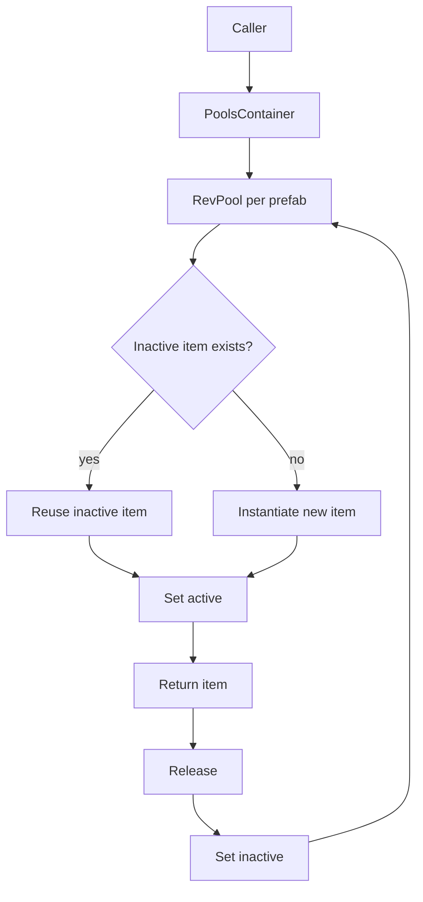

# RevCore.Pool Implementation Plan

> **For agentic workers:** REQUIRED SUB-SKILL: Use superpowers:subagent-driven-development (recommended) or superpowers:executing-plans to implement this plan task-by-task. Steps use checkbox (`- [ ]`) syntax for tracking.

**Goal:** Build RevCore.Pool as a Unity Package Manager package for reusable Component/GameObject pooling with low learning curve, delayed release support, and no RCore dependency.

**Architecture:** Runtime contains generic Component pools and pool containers. Delayed release uses RevCore.Timer, not old RCore `TimerEventsInScene`. Editor-only debug inspectors live in a separate Editor asmdef; runtime has no `UnityEditor` or `RCore.Editor` references.

**Tech Stack:** Unity 2022.3, C#, NUnit EditMode tests, Unity asmdefs, UPM package layout, dependencies on RevCore.Foundation and RevCore.Timer.

---

## Source Audit

RCore pool source lives in:

- `Assets/RCore/Main/Runtime/Common/Pool/CustomPool.cs`
  - `RCore.CustomPool<T> where T : Component`
  - Public API: `onSpawn`, `Prefab`, `Parent`, `Name`, `pushToLastSibling`, `limitNumber`, `ActiveList()`, `InactiveList()`, `Prepare(int)`, `Spawn()`, `Spawn(Transform)`, `Spawn(Vector3,bool)`, `Spawn(Vector3,bool,out bool)`, `AddOutsider`, `AddOutsiders`, `Release(T)`, delayed `Release(T,float)`, conditional `Release(T,ConditionalDelegate)`, `Release(GameObject)`, `ReleaseAll()`, `DestroyAll()`, `Destroy(T)`, find/get helpers, `SetParent`, `SetName`.
  - Dependencies: UnityEngine, LINQ, RCore `ComponentHelper.Prepare`, `IsPrefab`, `SetParent`, `TimerEventsInScene`, `CountdownEvent`, `ConditionEvent`, `RCore.Editor.EditorHelper`.
  - Risk: runtime file contains editor code guarded with `#if UNITY_EDITOR`, plus delayed release depends on old TimerEvents.
- `Assets/RCore/Main/Runtime/Common/Pool/PoolsContainer.cs`
  - `RCore.PoolsContainer<T> where T : Component`
  - Public API: `Get`, `CreatePool`, `Spawn`, `Add`, `Release`, `ReleaseAll`, `FindComponent`, `GetActiveList`, `GetAllItems`, editor debug draw.
  - Dependencies: UnityEngine, `CustomPool<T>`, `RCore.Editor.EditorHelper`.
- `Assets/RCore/Main/Samples~/Examples/Script/ExamplePoolsManager.cs`
  - Shows pool use, delayed release, inspector debug draw.

RevCore.Pool keeps useful API shape, removes RCore editor helper, uses RevCore.Timer for delayed/condition releases, and provides basic tests.

## File Structure

Create these files only:

```text
Assets/RevCore/Pool/
  package.json
  README.md
  CHANGELOG.md
  Runtime/
    RevCore.Pool.Runtime.asmdef
    Contracts/
      IPool.cs
      IPoolContainer.cs
    Core/
      RevPool.cs
      PoolsContainer.cs
      PoolObject.cs
    Helpers/
      PoolComponentExtensions.cs
  Editor/
    RevCore.Pool.Editor.asmdef
    RevPoolDebugDrawer.cs
  Tests/
    Runtime/
      RevCore.Pool.Tests.asmdef
      RevPoolTests.cs
      PoolsContainerTests.cs
  Samples~/
    PoolSample/
      PoolSample.cs
```

No files under `Assets/RCore/` are modified.

## Package API

### `IPool<T>`

```csharp
using System.Collections.Generic;
using UnityEngine;

namespace RevCore
{
    public interface IPool<T> where T : Component
    {
        T Prefab { get; }
        Transform Parent { get; }
        string Name { get; }
        int ActiveCount { get; }
        int InactiveCount { get; }
        T Spawn();
        T Spawn(Vector3 position, bool worldPosition = true);
        void Release(T item);
        void ReleaseAll();
        IReadOnlyList<T> ActiveItems { get; }
        IReadOnlyList<T> InactiveItems { get; }
    }
}
```

### `IPoolContainer<T>`

```csharp
using UnityEngine;

namespace RevCore
{
    public interface IPoolContainer<T> where T : Component
    {
        int PoolCount { get; }
        RevPool<T> Get(T prefab);
        T Spawn(T prefab);
        T Spawn(T prefab, Vector3 position, bool worldPosition = true);
        void Release(T item);
        void ReleaseAll();
    }
}
```

---

### Task 1: Package scaffold

**Files:**
- Create: `Assets/RevCore/Pool/package.json`
- Create: `Assets/RevCore/Pool/CHANGELOG.md`
- Create: `Assets/RevCore/Pool/Runtime/RevCore.Pool.Runtime.asmdef`
- Create: `Assets/RevCore/Pool/Editor/RevCore.Pool.Editor.asmdef`
- Create: `Assets/RevCore/Pool/Tests/Runtime/RevCore.Pool.Tests.asmdef`

- [ ] **Step 1: Create package manifest**

Write `Assets/RevCore/Pool/package.json`:

```json
{
  "name": "com.rabear.revcore.pool",
  "version": "0.1.0",
  "displayName": "RevCore.Pool",
  "description": "Reusable Component and GameObject pooling for the RevCore framework.",
  "unity": "2022.3",
  "documentationUrl": "https://github.com/hnb-rabear/RCore",
  "author": {
    "name": "HNB RaBear",
    "email": "nbhung71711@gmail.com",
    "url": "https://github.com/hnb-rabear"
  },
  "keywords": ["pool", "object-pool", "framework", "performance"],
  "dependencies": {
    "com.rabear.revcore.foundation": "0.1.0",
    "com.rabear.revcore.timer": "0.1.0"
  }
}
```

- [ ] **Step 2: Create runtime asmdef**

Write `Assets/RevCore/Pool/Runtime/RevCore.Pool.Runtime.asmdef`:

```json
{
  "name": "RevCore.Pool.Runtime",
  "rootNamespace": "RevCore",
  "references": [
    "RevCore.Foundation.Runtime",
    "RevCore.Timer.Runtime"
  ],
  "includePlatforms": [],
  "excludePlatforms": [],
  "allowUnsafeCode": false,
  "overrideReferences": false,
  "precompiledReferences": [],
  "autoReferenced": true,
  "defineConstraints": [],
  "versionDefines": [],
  "noEngineReferences": false
}
```

- [ ] **Step 3: Create editor asmdef**

Write `Assets/RevCore/Pool/Editor/RevCore.Pool.Editor.asmdef`:

```json
{
  "name": "RevCore.Pool.Editor",
  "rootNamespace": "RevCore.Editor",
  "references": ["RevCore.Pool.Runtime"],
  "includePlatforms": ["Editor"],
  "excludePlatforms": [],
  "allowUnsafeCode": false,
  "overrideReferences": false,
  "precompiledReferences": [],
  "autoReferenced": false,
  "defineConstraints": [],
  "versionDefines": [],
  "noEngineReferences": false
}
```

- [ ] **Step 4: Create test asmdef**

Write `Assets/RevCore/Pool/Tests/Runtime/RevCore.Pool.Tests.asmdef`:

```json
{
  "name": "RevCore.Pool.Tests",
  "rootNamespace": "RevCore.Tests",
  "references": [
    "RevCore.Pool.Runtime",
    "RevCore.Foundation.Runtime",
    "RevCore.Timer.Runtime",
    "UnityEngine.TestRunner",
    "UnityEditor.TestRunner"
  ],
  "includePlatforms": [],
  "excludePlatforms": [],
  "allowUnsafeCode": false,
  "overrideReferences": true,
  "precompiledReferences": [
    "nunit.framework.dll"
  ],
  "autoReferenced": false,
  "defineConstraints": [
    "UNITY_INCLUDE_TESTS"
  ],
  "versionDefines": [],
  "noEngineReferences": false
}
```

- [ ] **Step 5: Create changelog**

Write `Assets/RevCore/Pool/CHANGELOG.md`:

```markdown
# Changelog

## [0.1.0] - 2026-05-13

### Added
- Package scaffold
- Generic `RevPool<T>` for Unity Components
- `PoolsContainer<T>` for prefab-keyed pools
- Delayed and conditional release via RevCore.Timer
- Pool object helper component
- Runtime tests
- README and sample
```

- [ ] **Step 6: Review scaffold**

Read scaffold files and verify:
- package name is `com.rabear.revcore.pool`
- runtime references only Foundation + Timer
- editor asmdef is Editor-only and not auto-referenced
- tests reference Pool, Foundation, Timer, NUnit
- no `Assets/RCore/` change

---

### Task 2: Contracts and helper extensions

**Files:**
- Create: `Assets/RevCore/Pool/Runtime/Contracts/IPool.cs`
- Create: `Assets/RevCore/Pool/Runtime/Contracts/IPoolContainer.cs`
- Create: `Assets/RevCore/Pool/Runtime/Helpers/PoolComponentExtensions.cs`

- [ ] **Step 1: Create `IPool`**

Write `Assets/RevCore/Pool/Runtime/Contracts/IPool.cs`:

```csharp
using System.Collections.Generic;
using UnityEngine;

namespace RevCore
{
    public interface IPool<T> where T : Component
    {
        T Prefab { get; }
        Transform Parent { get; }
        string Name { get; }
        int ActiveCount { get; }
        int InactiveCount { get; }
        T Spawn();
        T Spawn(Vector3 position, bool worldPosition = true);
        void Release(T item);
        void ReleaseAll();
        IReadOnlyList<T> ActiveItems { get; }
        IReadOnlyList<T> InactiveItems { get; }
    }
}
```

- [ ] **Step 2: Create `IPoolContainer`**

Write `Assets/RevCore/Pool/Runtime/Contracts/IPoolContainer.cs`:

```csharp
using UnityEngine;

namespace RevCore
{
    public interface IPoolContainer<T> where T : Component
    {
        int PoolCount { get; }
        RevPool<T> Get(T prefab);
        T Spawn(T prefab);
        T Spawn(T prefab, Vector3 position, bool worldPosition = true);
        void Release(T item);
        void ReleaseAll();
    }
}
```

- [ ] **Step 3: Create helper extensions**

Write `Assets/RevCore/Pool/Runtime/Helpers/PoolComponentExtensions.cs`:

```csharp
using System.Collections.Generic;
using UnityEngine;
using Object = UnityEngine.Object;

namespace RevCore
{
    internal static class PoolComponentExtensions
    {
        public static void Prepare<T>(this List<T> list, T prefab, Transform parent, int count, string name) where T : Component
        {
            for (int i = 0; i < count; i++)
            {
                var item = Object.Instantiate(prefab, parent);
                item.name = name;
                item.gameObject.SetActive(false);
                list.Add(item);
            }
        }

        public static bool IsSceneObject(this Component component)
        {
            return component != null && component.gameObject.scene.IsValid();
        }
    }
}
```

- [ ] **Step 4: Review contracts/helpers**

Read files and verify:
- namespace is `RevCore`
- helper is `internal static`
- helper uses Unity runtime APIs only, no `UnityEditor`
- no `RCore` refs

---

### Task 3: RevPool core

**Files:**
- Create: `Assets/RevCore/Pool/Runtime/Core/RevPool.cs`
- Test: `Assets/RevCore/Pool/Tests/Runtime/RevPoolTests.cs`

- [ ] **Step 1: Write pool tests**

Write `Assets/RevCore/Pool/Tests/Runtime/RevPoolTests.cs`:

```csharp
using NUnit.Framework;
using UnityEngine;

namespace RevCore.Tests
{
    public class RevPoolTests
    {
        private GameObject m_prefab;
        private Transform m_parent;

        [SetUp]
        public void SetUp()
        {
            m_prefab = new GameObject("BulletPrefab");
            m_prefab.AddComponent<PoolObject>();
            m_parent = new GameObject("PoolParent").transform;
        }

        [TearDown]
        public void TearDown()
        {
            Object.DestroyImmediate(m_prefab);
            Object.DestroyImmediate(m_parent.gameObject);
        }

        [Test]
        public void Constructor_prewarms_inactive_items()
        {
            var pool = new RevPool<PoolObject>(m_prefab.GetComponent<PoolObject>(), 2, m_parent);

            Assert.AreEqual(0, pool.ActiveCount);
            Assert.AreEqual(2, pool.InactiveCount);
            Assert.AreEqual("BulletPrefab", pool.Name);
        }

        [Test]
        public void Spawn_activates_item_and_reuses_inactive()
        {
            var pool = new RevPool<PoolObject>(m_prefab.GetComponent<PoolObject>(), 1, m_parent);

            var item = pool.Spawn(new Vector3(1f, 2f, 3f));

            Assert.IsTrue(item.gameObject.activeSelf);
            Assert.AreEqual(1, pool.ActiveCount);
            Assert.AreEqual(0, pool.InactiveCount);
            Assert.AreEqual(new Vector3(1f, 2f, 3f), item.transform.position);
        }

        [Test]
        public void Release_moves_item_to_inactive()
        {
            var pool = new RevPool<PoolObject>(m_prefab.GetComponent<PoolObject>(), 1, m_parent);
            var item = pool.Spawn();

            pool.Release(item);

            Assert.IsFalse(item.gameObject.activeSelf);
            Assert.AreEqual(0, pool.ActiveCount);
            Assert.AreEqual(1, pool.InactiveCount);
        }

        [Test]
        public void Limit_reuses_oldest_active_item()
        {
            var pool = new RevPool<PoolObject>(m_prefab.GetComponent<PoolObject>(), 0, m_parent)
            {
                LimitNumber = 1
            };

            var first = pool.Spawn();
            var second = pool.Spawn();

            Assert.AreSame(first, second);
            Assert.AreEqual(1, pool.ActiveCount);
            Assert.AreEqual(0, pool.InactiveCount);
        }
    }
}
```

- [ ] **Step 2: Create `RevPool`**

Write `Assets/RevCore/Pool/Runtime/Core/RevPool.cs`:

```csharp
using System;
using System.Collections.Generic;
using UnityEngine;
using Object = UnityEngine.Object;

namespace RevCore
{
    [Serializable]
    public class RevPool<T> : IPool<T> where T : Component
    {
        public Action<T> OnSpawn;

        [SerializeField] private T m_prefab;
        [SerializeField] private Transform m_parent;
        [SerializeField] private string m_name;
        [SerializeField] private bool m_pushToLastSibling;
        [SerializeField] private bool m_autoRelocate = true;
        [SerializeField] private int m_limitNumber;
        [SerializeField] private List<T> m_activeList = new();
        [SerializeField] private List<T> m_inactiveList = new();

        private int m_initialCount;
        private bool m_initialized;

        public T Prefab => m_prefab;
        public Transform Parent => m_parent;
        public string Name => m_name;
        public int ActiveCount => m_activeList.Count;
        public int InactiveCount => m_inactiveList.Count;
        public IReadOnlyList<T> ActiveItems => m_activeList;
        public IReadOnlyList<T> InactiveItems => m_inactiveList;
        public bool PushToLastSibling { get => m_pushToLastSibling; set => m_pushToLastSibling = value; }
        public int LimitNumber { get => m_limitNumber; set => m_limitNumber = value; }

        public RevPool() { }

        public RevPool(T prefab, int initialCount, Transform parent, string name = "", bool autoRelocate = true)
        {
            m_prefab = prefab;
            m_parent = parent;
            m_name = name;
            m_autoRelocate = autoRelocate;
            m_initialCount = initialCount;
            Init();
        }

        public RevPool(GameObject prefab, int initialCount, Transform parent, string name = "", bool autoRelocate = true)
        {
            m_prefab = prefab.GetComponent<T>();
            m_parent = parent;
            m_name = name;
            m_autoRelocate = autoRelocate;
            m_initialCount = initialCount;
            Init();
        }

        public List<T> ActiveList() => m_activeList;
        public List<T> InactiveList() => m_inactiveList;

        public void Init()
        {
            if (m_initialized)
                return;

            if (m_prefab == null)
                throw new InvalidOperationException("RevPool prefab is null.");

            if (string.IsNullOrEmpty(m_name))
                m_name = m_prefab.name;

            if (m_parent == null)
            {
                var root = new GameObject($"Pool_{m_name}");
                m_parent = root.transform;
            }

            m_activeList = new List<T>();
            m_inactiveList = new List<T>();
            m_inactiveList.Prepare(m_prefab, m_parent, m_initialCount, m_name);

            if (m_prefab.IsSceneObject())
            {
                m_inactiveList.Add(m_prefab);
                m_prefab.transform.SetParent(m_parent);
                m_prefab.transform.SetAsLastSibling();
                m_prefab.gameObject.SetActive(false);
            }

            m_initialized = true;
        }

        public void Prepare(int count)
        {
            int needed = count - m_inactiveList.Count;
            if (needed > 0)
                m_inactiveList.Prepare(m_prefab, m_parent, needed, m_name);
        }

        public T Spawn()
        {
            return Spawn(Vector3.zero, false);
        }

        public T Spawn(Transform point)
        {
            return Spawn(point.position, true);
        }

        public T Spawn(Vector3 position, bool worldPosition = true)
        {
            return Spawn(position, worldPosition, out _);
        }

        public T Spawn(Vector3 position, bool worldPosition, out bool reused)
        {
            if (m_limitNumber > 0 && m_activeList.Count == m_limitNumber)
            {
                var oldest = m_activeList[0];
                MoveToInactive(oldest, 0);
            }

            RemoveNullInactiveItems();
            if (m_autoRelocate && m_inactiveList.Count == 0)
                RelocateInactive();

            if (m_inactiveList.Count == 0)
            {
                var item = Object.Instantiate(m_prefab, m_parent);
                item.name = m_name;
                item.gameObject.SetActive(false);
                m_inactiveList.Add(item);
                reused = false;
            }
            else
            {
                reused = true;
            }

            int index = m_inactiveList.Count - 1;
            var spawned = m_inactiveList[index];
            if (worldPosition)
                spawned.transform.position = position;
            else
                spawned.transform.localPosition = position;

            MoveToActive(spawned, index);
            if (m_pushToLastSibling)
                spawned.transform.SetAsLastSibling();

            OnSpawn?.Invoke(spawned);
            return spawned;
        }

        public void AddOutsiders(List<T> sceneObjects)
        {
            for (int i = sceneObjects.Count - 1; i >= 0; i--)
                AddOutsider(sceneObjects[i]);
        }

        public void AddOutsider(T sceneObject)
        {
            if (sceneObject == null || m_activeList.Contains(sceneObject) || m_inactiveList.Contains(sceneObject))
                return;

            sceneObject.transform.SetParent(m_parent);
            if (sceneObject.gameObject.activeSelf)
                m_activeList.Add(sceneObject);
            else
                m_inactiveList.Add(sceneObject);
        }

        public void Release(T item)
        {
            if (item == null)
                return;

            for (int i = 0; i < m_activeList.Count; i++)
            {
                if (ReferenceEquals(m_activeList[i], item))
                {
                    MoveToInactive(item, i);
                    return;
                }
            }
        }

        public void Release(T item, float delaySeconds)
        {
            if (delaySeconds <= 0f)
            {
                Timers.Cancel(item.GetInstanceID());
                Release(item);
                return;
            }

            Timers.WaitForSeconds(delaySeconds, () => Release(item), false, item.GetInstanceID());
        }

        public void Release(T item, ConditionalDelegate condition)
        {
            if (item == null)
                return;

            Timers.WaitForCondition(condition, () => Release(item), item.GetInstanceID());
        }

        public void Release(GameObject item)
        {
            var component = FindComponent(item);
            Release(component);
        }

        public void ReleaseAll()
        {
            for (int i = m_activeList.Count - 1; i >= 0; i--)
                MoveToInactive(m_activeList[i], i);
        }

        public void DestroyAll()
        {
            DestroyList(m_activeList);
            DestroyList(m_inactiveList);
            m_activeList.Clear();
            m_inactiveList.Clear();
        }

        public void Destroy(T item)
        {
            if (item == null)
                return;

            m_activeList.Remove(item);
            m_inactiveList.Remove(item);
            DestroyObject(item.gameObject);
        }

        public T FindFromActive(T item)
        {
            return m_activeList.Contains(item) ? item : null;
        }

        public T FindFromInactive(T item)
        {
            return m_inactiveList.Contains(item) ? item : null;
        }

        public T FindComponent(GameObject gameObject)
        {
            for (int i = 0; i < m_activeList.Count; i++)
                if (m_activeList[i] != null && m_activeList[i].gameObject == gameObject)
                    return m_activeList[i];

            for (int i = 0; i < m_inactiveList.Count; i++)
                if (m_inactiveList[i] != null && m_inactiveList[i].gameObject == gameObject)
                    return m_inactiveList[i];

            return null;
        }

        public T GetFromActive(int index)
        {
            return index >= 0 && index < m_activeList.Count ? m_activeList[index] : null;
        }

        public void SetParent(Transform parent)
        {
            m_parent = parent;
        }

        public void SetName(string name)
        {
            m_name = name;
        }

        private void MoveToActive(T item, int inactiveIndex)
        {
            m_inactiveList.RemoveAt(inactiveIndex);
            m_activeList.Add(item);
            item.gameObject.SetActive(true);
        }

        private void MoveToInactive(T item, int activeIndex)
        {
            m_activeList.RemoveAt(activeIndex);
            m_inactiveList.Add(item);
            item.gameObject.SetActive(false);
        }

        private void RelocateInactive()
        {
            for (int i = m_activeList.Count - 1; i >= 0; i--)
            {
                var item = m_activeList[i];
                if (item == null)
                {
                    m_activeList.RemoveAt(i);
                    continue;
                }

                if (!item.gameObject.activeSelf)
                    MoveToInactive(item, i);
            }
        }

        private void RemoveNullInactiveItems()
        {
            for (int i = m_inactiveList.Count - 1; i >= 0; i--)
                if (m_inactiveList[i] == null)
                    m_inactiveList.RemoveAt(i);
        }

        private static void DestroyList(List<T> list)
        {
            for (int i = list.Count - 1; i >= 0; i--)
                if (list[i] != null)
                    DestroyObject(list[i].gameObject);
        }

        private static void DestroyObject(GameObject gameObject)
        {
            if (Application.isPlaying)
                Object.Destroy(gameObject);
            else
                Object.DestroyImmediate(gameObject);
        }
    }
}
```

- [ ] **Step 3: Review RevPool**

Read `RevPool.cs` and `RevPoolTests.cs`. Verify:
- runtime has no `UnityEditor`, `RCore`, `EditorHelper`, `TimerEventsInScene`, `CountdownEvent`, `ConditionEvent`
- delayed release uses `Timers.WaitForSeconds`
- conditional release uses `Timers.WaitForCondition`
- tests create and destroy Unity GameObjects

---

### Task 4: PoolObject marker component

**Files:**
- Create: `Assets/RevCore/Pool/Runtime/Core/PoolObject.cs`
- Modify: `Assets/RevCore/Pool/Tests/Runtime/RevPoolTests.cs`

- [ ] **Step 1: Create `PoolObject`**

Write `Assets/RevCore/Pool/Runtime/Core/PoolObject.cs`:

```csharp
using UnityEngine;

namespace RevCore
{
    public class PoolObject : MonoBehaviour
    {
        public ITimerHandle ReleaseHandle { get; internal set; }
    }
}
```

- [ ] **Step 2: Add delayed release test**

Append this test inside `RevPoolTests`:

```csharp
[Test]
public void Delayed_release_uses_timers_facade()
{
    var previous = Timers.Scheduler;
    var scheduler = new TimerScheduler();
    Timers.Scheduler = scheduler;
    var pool = new RevPool<PoolObject>(m_prefab.GetComponent<PoolObject>(), 1, m_parent);
    var item = pool.Spawn();

    pool.Release(item, 1f);
    scheduler.Tick(1f, 1f);

    Assert.AreEqual(0, pool.ActiveCount);
    Assert.AreEqual(1, pool.InactiveCount);
    Timers.Scheduler = previous;
}
```

- [ ] **Step 3: Review PoolObject and delayed release**

Read `PoolObject.cs`, `RevPool.cs`, and tests. Verify:
- `PoolObject` has no lifecycle logic.
- delayed release test restores previous scheduler.
- no static scheduler leak in test.

---

### Task 5: PoolsContainer

**Files:**
- Create: `Assets/RevCore/Pool/Runtime/Core/PoolsContainer.cs`
- Test: `Assets/RevCore/Pool/Tests/Runtime/PoolsContainerTests.cs`

- [ ] **Step 1: Write container tests**

Write `Assets/RevCore/Pool/Tests/Runtime/PoolsContainerTests.cs`:

```csharp
using NUnit.Framework;
using UnityEngine;

namespace RevCore.Tests
{
    public class PoolsContainerTests
    {
        private GameObject m_prefab;
        private PoolsContainer<PoolObject> m_container;

        [SetUp]
        public void SetUp()
        {
            m_prefab = new GameObject("EnemyPrefab");
            m_prefab.AddComponent<PoolObject>();
            m_container = new PoolsContainer<PoolObject>("Pools", 1);
        }

        [TearDown]
        public void TearDown()
        {
            Object.DestroyImmediate(m_prefab);
            Object.DestroyImmediate(m_container.Container.gameObject);
        }

        [Test]
        public void Get_creates_one_pool_per_prefab()
        {
            var prefab = m_prefab.GetComponent<PoolObject>();

            var first = m_container.Get(prefab);
            var second = m_container.Get(prefab);

            Assert.AreSame(first, second);
            Assert.AreEqual(1, m_container.PoolCount);
        }

        [Test]
        public void Spawn_tracks_clone_to_pool_for_release()
        {
            var prefab = m_prefab.GetComponent<PoolObject>();
            var clone = m_container.Spawn(prefab, new Vector3(4f, 5f, 6f));

            m_container.Release(clone);

            Assert.IsFalse(clone.gameObject.activeSelf);
            Assert.AreEqual(0, m_container.Get(prefab).ActiveCount);
        }

        [Test]
        public void ReleaseAll_releases_all_pools()
        {
            var prefab = m_prefab.GetComponent<PoolObject>();
            m_container.Spawn(prefab);
            m_container.Spawn(prefab);

            m_container.ReleaseAll();

            Assert.AreEqual(0, m_container.Get(prefab).ActiveCount);
        }
    }
}
```

- [ ] **Step 2: Create `PoolsContainer`**

Write `Assets/RevCore/Pool/Runtime/Core/PoolsContainer.cs`:

```csharp
using System.Collections.Generic;
using UnityEngine;

namespace RevCore
{
    public class PoolsContainer<T> : IPoolContainer<T> where T : Component
    {
        private readonly Dictionary<int, RevPool<T>> m_poolByPrefabId = new();
        private readonly Dictionary<T, RevPool<T>> m_cloneToPool = new();
        private readonly Dictionary<T, RevPool<T>> m_prefabToPool = new();
        private readonly int m_initialCount;

        public Transform Container { get; }
        public int LimitNumber { get; set; }
        public int PoolCount => m_poolByPrefabId.Count;

        public PoolsContainer(Transform container)
        {
            Container = container;
        }

        public PoolsContainer(string containerName, int initialCount = 1, Transform parent = null)
        {
            var root = new GameObject(containerName);
            root.transform.SetParent(parent);
            root.transform.localPosition = Vector3.zero;
            root.transform.rotation = Quaternion.identity;
            Container = root.transform;
            m_initialCount = initialCount;
        }

        public RevPool<T> Get(T prefab)
        {
            if (prefab == null)
                return null;

            if (m_prefabToPool.TryGetValue(prefab, out var cached))
                return cached;

            int id = prefab.gameObject.GetInstanceID();
            if (m_poolByPrefabId.TryGetValue(id, out var existing))
            {
                m_prefabToPool[prefab] = existing;
                return existing;
            }

            var pool = new RevPool<T>(prefab, m_initialCount, Container);
            pool.LimitNumber = LimitNumber;
            m_poolByPrefabId[id] = pool;
            m_prefabToPool[prefab] = pool;
            return pool;
        }

        public void CreatePool(T prefab, List<T> sceneObjects)
        {
            Get(prefab).AddOutsiders(sceneObjects);
        }

        public T Spawn(T prefab)
        {
            return Spawn(prefab, Vector3.zero, false);
        }

        public T Spawn(T prefab, Vector3 position, bool worldPosition = true)
        {
            var pool = Get(prefab);
            var clone = pool.Spawn(position, worldPosition);
            if (!m_cloneToPool.ContainsKey(clone))
                m_cloneToPool.Add(clone, pool);
            return clone;
        }

        public T Spawn(T prefab, Transform point)
        {
            return Spawn(prefab, point.position, true);
        }

        public RevPool<T> Add(T prefab)
        {
            return Get(prefab);
        }

        public void Add(RevPool<T> pool)
        {
            if (pool == null || pool.Prefab == null)
                return;

            int id = pool.Prefab.gameObject.GetInstanceID();
            if (!m_poolByPrefabId.ContainsKey(id))
            {
                m_poolByPrefabId[id] = pool;
                m_prefabToPool[pool.Prefab] = pool;
                return;
            }

            var existing = m_poolByPrefabId[id];
            foreach (var item in pool.ActiveList())
                if (!existing.ActiveList().Contains(item))
                    existing.ActiveList().Add(item);
            foreach (var item in pool.InactiveList())
                if (!existing.InactiveList().Contains(item))
                    existing.InactiveList().Add(item);
        }

        public List<T> GetActiveList()
        {
            var output = new List<T>();
            foreach (var pool in m_poolByPrefabId.Values)
                output.AddRange(pool.ActiveList());
            return output;
        }

        public List<T> GetAllItems()
        {
            var output = new List<T>();
            foreach (var pool in m_poolByPrefabId.Values)
            {
                output.AddRange(pool.ActiveList());
                output.AddRange(pool.InactiveList());
            }
            return output;
        }

        public void Release(T item)
        {
            if (item == null)
                return;

            if (m_cloneToPool.TryGetValue(item, out var pool))
            {
                pool.Release(item);
                return;
            }

            foreach (var candidate in m_poolByPrefabId.Values)
                candidate.Release(item);
        }

        public void Release(T prefab, T item)
        {
            Get(prefab)?.Release(item);
        }

        public void Release(GameObject gameObject)
        {
            foreach (var pool in m_poolByPrefabId.Values)
                pool.Release(gameObject);
        }

        public void ReleaseAll()
        {
            foreach (var pool in m_poolByPrefabId.Values)
                pool.ReleaseAll();
        }

        public T FindComponent(GameObject gameObject)
        {
            foreach (var pool in m_poolByPrefabId.Values)
            {
                var component = pool.FindComponent(gameObject);
                if (component != null)
                    return component;
            }

            return null;
        }
    }
}
```

- [ ] **Step 3: Review PoolsContainer**

Read container and tests. Verify:
- container keeps clone-to-pool map
- no editor code
- no RCore dependency
- constructor creates container GameObject

---

### Task 6: Editor debug drawer

**Files:**
- Create: `Assets/RevCore/Pool/Editor/RevPoolDebugDrawer.cs`

- [ ] **Step 1: Create editor debug drawer**

Write `Assets/RevCore/Pool/Editor/RevPoolDebugDrawer.cs`:

```csharp
using UnityEditor;
using UnityEngine;

namespace RevCore.Editor
{
    public static class RevPoolDebugDrawer
    {
        public static void Draw<T>(string label, RevPool<T> pool) where T : Component
        {
            if (pool == null)
            {
                EditorGUILayout.HelpBox($"{label}: null", MessageType.Info);
                return;
            }

            EditorGUILayout.LabelField(label, EditorStyles.boldLabel);
            EditorGUILayout.LabelField("Active", pool.ActiveCount.ToString());
            EditorGUILayout.LabelField("Inactive", pool.InactiveCount.ToString());
            EditorGUILayout.ObjectField("Prefab", pool.Prefab, typeof(T), false);
            EditorGUILayout.ObjectField("Parent", pool.Parent, typeof(Transform), true);
        }
    }
}
```

- [ ] **Step 2: Review editor split**

Read `RevPoolDebugDrawer.cs` and asmdefs. Verify:
- editor code is only under `Assets/RevCore/Pool/Editor/`
- namespace is `RevCore.Editor`
- runtime asmdef does not reference editor asmdef
- no runtime `UnityEditor` refs

---

### Task 7: README and sample

**Files:**
- Create: `Assets/RevCore/Pool/README.md`
- Create: `Assets/RevCore/Pool/Samples~/PoolSample/PoolSample.cs`

- [ ] **Step 1: Create README**

Write `Assets/RevCore/Pool/README.md`:

```markdown
# RevCore.Pool

Reusable Component and GameObject pooling for RevCore.

## Install

Unity Package Manager, local path:

```text
Assets/RevCore/Pool
```

Or by name when published:

```json
"com.rabear.revcore.pool": "0.1.0"
```

Requires:

```json
"com.rabear.revcore.foundation": "0.1.0",
"com.rabear.revcore.timer": "0.1.0"
```

## 60-second Quick Start

```csharp
using UnityEngine;
using RevCore;

public class BulletSpawner : MonoBehaviour
{
    [SerializeField] private PoolObject bulletPrefab;
    private PoolsContainer<PoolObject> pools;

    private void Awake()
    {
        pools = new PoolsContainer<PoolObject>("BulletPools", 10, transform);
    }

    public void Fire(Vector3 position)
    {
        var bullet = pools.Spawn(bulletPrefab, position);
        pools.Get(bulletPrefab).Release(bullet, 2f);
    }
}
```

## Concepts

### RevPool

`RevPool<T>` manages one prefab type.

```csharp
var pool = new RevPool<PoolObject>(prefab, 10, transform);
var item = pool.Spawn();
pool.Release(item);
```

### PoolsContainer

`PoolsContainer<T>` creates one pool per prefab and tracks spawned clones.

```csharp
var pools = new PoolsContainer<PoolObject>("Pools", 5);
var item = pools.Spawn(enemyPrefab);
pools.Release(item);
```

### Delayed release

Delayed release uses RevCore.Timer.

```csharp
pool.Release(item, 1.5f);
```

## Flow



## API Reference

| Type | Purpose |
|---|---|
| `IPool<T>` | Pool contract |
| `IPoolContainer<T>` | Pool container contract |
| `RevPool<T>` | Pool for one Component prefab |
| `PoolsContainer<T>` | Multi-prefab pool manager |
| `PoolObject` | Optional marker component for pooled GameObjects |
| `RevPoolDebugDrawer` | Editor-only debug UI helper |

## Migration from RCore

| RCore | RevCore.Pool |
|---|---|
| `CustomPool<T>` | `RevPool<T>` |
| `PoolsContainer<T>` | `PoolsContainer<T>` |
| `pool.limitNumber` | `pool.LimitNumber` |
| `pool.onSpawn` | `pool.OnSpawn` |
| `TimerEventsInScene` delayed release | `Timers.WaitForSeconds` via `pool.Release(item, delay)` |
| `DrawOnEditor()` inside runtime | `RevPoolDebugDrawer.Draw()` in Editor asmdef |

## Safety Notes

- RevCore.Pool does not modify RCore pools.
- Runtime has no `UnityEditor` dependency.
- Delayed release requires RevCore.Timer to tick via `Timers.Tick` or `GlobalTimers.Instance`.
- Destroy methods use `DestroyImmediate` outside Play Mode and `Destroy` in Play Mode.
```

- [ ] **Step 2: Create sample**

Write `Assets/RevCore/Pool/Samples~/PoolSample/PoolSample.cs`:

```csharp
using UnityEngine;

namespace RevCore.Samples
{
    public class PoolSample : MonoBehaviour
    {
        [SerializeField] private PoolObject prefab;
        private PoolsContainer<PoolObject> m_pools;

        private void Awake()
        {
            m_pools = new PoolsContainer<PoolObject>("SamplePools", 3, transform);
        }

        private void Update()
        {
            if (Input.GetKeyDown(KeyCode.Space))
            {
                var item = m_pools.Spawn(prefab, Random.insideUnitSphere * 3f);
                m_pools.Get(prefab).Release(item, 2f);
            }
        }
    }
}
```

- [ ] **Step 3: Review docs and sample**

Read README and sample. Verify:
- README has quick start, flow diagram, API table, migration table, safety notes.
- sample uses `PoolsContainer<PoolObject>` and delayed release.
- docs mention Timer ticking requirement.

---

### Task 8: Unity meta files and final review

**Files:**
- Create: `.meta` files under `Assets/RevCore/Pool/`

- [ ] **Step 1: Generate `.meta` files**

Generate Unity `.meta` files for every new folder and file under `Assets/RevCore/Pool/`.

Rules:
- folder `.meta`: `DefaultImporter` with `folderAsset: yes`
- `.cs.meta`: `MonoImporter`
- `.asmdef.meta`, `.json.meta`, `.md.meta`: `DefaultImporter`

- [ ] **Step 2: Review `.cs.meta` importer type**

Read or grep these files:

```text
Assets/RevCore/Pool/Runtime/Core/RevPool.cs.meta
Assets/RevCore/Pool/Runtime/Core/PoolsContainer.cs.meta
Assets/RevCore/Pool/Tests/Runtime/RevPoolTests.cs.meta
```

Expected: each contains `MonoImporter:`.

- [ ] **Step 3: Search for forbidden references**

Run searches:

```bash
grep -R "namespace RCore\|using RCore\|RCore.Editor\|EditorHelper\|TimerEventsInScene\|CountdownEvent\|ConditionEvent\|UnityEditor" Assets/RevCore/Pool/Runtime Assets/RevCore/Pool/Tests Assets/RevCore/Pool/Samples~
```

Expected: no matches.

Search editor separately:

```bash
grep -R "UnityEditor" Assets/RevCore/Pool/Editor
```

Expected: match only in editor file.

- [ ] **Step 4: Search for required files**

Verify these exist:

```text
Assets/RevCore/Pool/package.json
Assets/RevCore/Pool/Runtime/RevCore.Pool.Runtime.asmdef
Assets/RevCore/Pool/Editor/RevCore.Pool.Editor.asmdef
Assets/RevCore/Pool/Tests/Runtime/RevCore.Pool.Tests.asmdef
Assets/RevCore/Pool/README.md
Assets/RevCore/Pool/Samples~/PoolSample/PoolSample.cs
```

- [ ] **Step 5: Final implementation review**

Review actual files, not plan text:
- no changes under `Assets/RCore/`
- package depends only on Foundation + Timer
- all runtime `.cs` use namespace `RevCore`
- editor `.cs` use namespace `RevCore.Editor`
- runtime has no `UnityEditor` refs
- tests written but not claimed passing unless Unity actually ran

---

## Verification

Run after implementation:

```bash
git status --short
```

Expected:
- new `Assets/RevCore/Pool/` files
- new `docs/superpowers/plans/2026-05-13-revcore-pool.md`
- unrelated existing dirty files remain unstaged

If Unity command line is available, run EditMode tests for:

```text
RevCore.Pool.Tests
```

If Unity is not run, report that tests are written but not executed in Unity.

## Self-Review

Spec coverage:
- Independent UPM package: Task 1
- Low learning curve docs/sample: Task 7
- Safe RCore reuse: Source Audit + ported `CustomPool`/`PoolsContainer` concepts
- Less hidden coupling: Task 3 replaces old TimerEvents with RevCore.Timer facade
- Editor/runtime split: Task 6
- Docs/diagram/flows: Task 7
- Review after every task: each task has review step

Placeholder scan:
- No TBD/TODO/implement later placeholders.
- Every code-creating step includes concrete code.

Type consistency:
- `RevPool<T>`, `PoolsContainer<T>`, `PoolObject`, `IPool<T>`, `IPoolContainer<T>` names are consistent across runtime/tests/docs.
- `LimitNumber`, `OnSpawn`, `ActiveCount`, `InactiveCount` names match tests and README.
