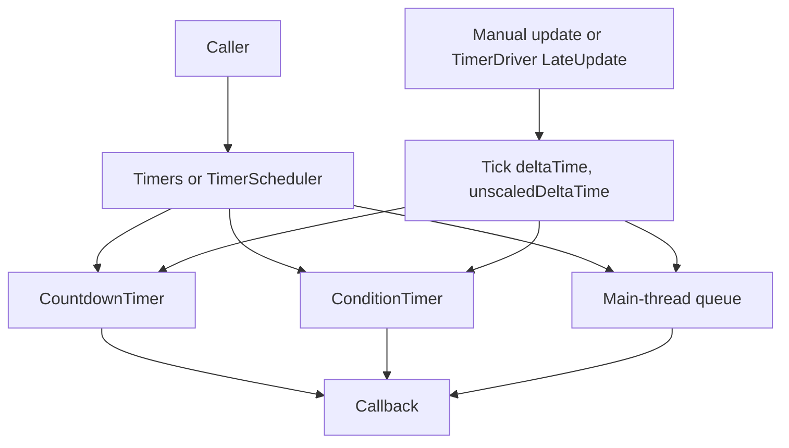

# RevCore.Timer Implementation Plan

> **For agentic workers:** REQUIRED SUB-SKILL: Use superpowers:subagent-driven-development (recommended) or superpowers:executing-plans to implement this plan task-by-task. Steps use checkbox (`- [ ]`) syntax for tracking.

**Goal:** Build RevCore.Timer as an independent Unity Package Manager package for manual timers, scheduled callbacks, conditional waits, debounced event publishing, and optional Unity-driven ticking.

**Architecture:** Runtime core is plain C# and can be updated manually, so gameplay systems can use timers without inheriting MonoBehaviour. A small optional MonoBehaviour driver provides scene/global ticking convenience for Unity projects. Foundation dependency is used only for `ConditionalDelegate`, `IEvent`, and `Events.Publish`.

**Tech Stack:** Unity 2022.3, C#, NUnit EditMode tests, Unity asmdefs, UPM package layout.

---

## Source Audit

RCore timer source lives in:

- `Assets/RCore/Main/Runtime/Common/Timer/TimedAction.cs`
  - `RCore.TimedAction`
  - Public API: `onFinished`, `timeTarget`, `IsRunning`, `RemainTime`, `UpdateWithTimeScale(float)`, `Update(float)`, `Start(float)`, `Finish()`, `SetElapsedTime(float)`, `GetElapsedTime()`, `Stop()`
  - Depends on `UnityEngine.Time` only for `UpdateWithTimeScale`.
- `Assets/RCore/Main/Runtime/Common/Timer/TimerEventsGroup.cs`
  - `RCore.CountdownEvent`
  - `RCore.ConditionEvent`
  - `RCore.DelayableEvent`
  - `RCore.CountdownEventsGroup`
  - `RCore.ConditionEventsGroup`
  - Depends on `ConditionalDelegate`, `BaseEvent`, `UnityEngine.Time`.
- `Assets/RCore/Main/Runtime/Common/Timer/TimerEvents.cs`
  - `RCore.TimerEvents : MonoBehaviour`
  - Public API: `WaitForSeconds`, `RemoveCountdownEvent`, `WaitForCondition`, `RemoveConditionEvent`, `WaitTask`, `AddDelayableEvent`, `Clear()`
  - Depends on MonoBehaviour, `ResourceRequest`, `EventDispatcher`.
- `Assets/RCore/Main/Runtime/Common/Timer/TimerEventsGlobal.cs`
  - `RCore.TimerEventsGlobal : TimerEvents`
  - Global singleton, DontDestroyOnLoad, main-thread queue.
- `Assets/RCore/Main/Runtime/Common/Timer/TimerEventsInScene.cs`
  - `RCore.TimerEventsInScene : TimerEvents`
  - Scene singleton.

RevCore.Timer keeps useful behavior but splits pure scheduler from MonoBehaviour driver.

## File Structure

Create these files only:

```text
Assets/RevCore/Timer/
  package.json
  README.md
  CHANGELOG.md
  Runtime/
    RevCore.Timer.Runtime.asmdef
    Contracts/
      ITimerScheduler.cs
      ITimerHandle.cs
    Core/
      TimerHandle.cs
      TimedAction.cs
      CountdownTimer.cs
      ConditionTimer.cs
      TimerScheduler.cs
      Timers.cs
    Unity/
      TimerDriver.cs
      GlobalTimers.cs
      SceneTimers.cs
  Tests/
    Runtime/
      RevCore.Timer.Tests.asmdef
      TimedActionTests.cs
      TimerSchedulerTests.cs
      GlobalTimersTests.cs
  Samples~/
    TimerSample/
      TimerSample.cs
```

All `.cs` files use namespace `RevCore`. No files under `Assets/RCore/` are modified.

## Package API

### `ITimerHandle`

```csharp
namespace RevCore
{
    public interface ITimerHandle
    {
        int Id { get; }
        bool IsRunning { get; }
        bool IsCompleted { get; }
        bool IsCancelled { get; }
        float Elapsed { get; }
        float Duration { get; }
        float Remaining { get; }
        void Cancel();
    }
}
```

### `ITimerScheduler`

```csharp
using System;

namespace RevCore
{
    public interface ITimerScheduler
    {
        int ActiveCount { get; }
        ITimerHandle WaitForSeconds(float seconds, Action onComplete, bool unscaledTime = false, int id = 0);
        ITimerHandle WaitForSeconds(float seconds, Action<float> onComplete, bool unscaledTime = false, int id = 0);
        ITimerHandle WaitForCondition(ConditionalDelegate condition, Action onComplete, int id = 0);
        ITimerHandle Debounce<T>(T evt, float seconds) where T : IEvent;
        void Enqueue(Action action);
        void Tick(float deltaTime, float unscaledDeltaTime);
        void Cancel(int id);
        void Cancel(ITimerHandle handle);
        void Clear();
    }
}
```

---

### Task 1: Package scaffold

**Files:**
- Create: `Assets/RevCore/Timer/package.json`
- Create: `Assets/RevCore/Timer/CHANGELOG.md`
- Create: `Assets/RevCore/Timer/Runtime/RevCore.Timer.Runtime.asmdef`
- Create: `Assets/RevCore/Timer/Tests/Runtime/RevCore.Timer.Tests.asmdef`

- [ ] **Step 1: Create package manifest**

Write `Assets/RevCore/Timer/package.json`:

```json
{
  "name": "com.rabear.revcore.timer",
  "version": "0.1.0",
  "displayName": "RevCore.Timer",
  "description": "Manual and Unity-driven timer scheduling for the RevCore framework.",
  "unity": "2022.3",
  "documentationUrl": "https://github.com/hnb-rabear/RCore",
  "author": {
    "name": "HNB RaBear",
    "email": "nbhung71711@gmail.com",
    "url": "https://github.com/hnb-rabear"
  },
  "keywords": ["timer", "scheduler", "countdown", "framework"],
  "dependencies": {
    "com.rabear.revcore.foundation": "0.1.0"
  }
}
```

- [ ] **Step 2: Create runtime asmdef**

Write `Assets/RevCore/Timer/Runtime/RevCore.Timer.Runtime.asmdef`:

```json
{
  "name": "RevCore.Timer.Runtime",
  "rootNamespace": "RevCore",
  "references": ["RevCore.Foundation.Runtime"],
  "includePlatforms": [],
  "excludePlatforms": [],
  "allowUnsafeCode": false,
  "overrideReferences": false,
  "precompiledReferences": [],
  "autoReferenced": true,
  "defineConstraints": [],
  "versionDefines": [],
  "noEngineReferences": false
}
```

- [ ] **Step 3: Create test asmdef**

Write `Assets/RevCore/Timer/Tests/Runtime/RevCore.Timer.Tests.asmdef`:

```json
{
  "name": "RevCore.Timer.Tests",
  "rootNamespace": "RevCore.Tests",
  "references": [
    "RevCore.Timer.Runtime",
    "RevCore.Foundation.Runtime",
    "UnityEngine.TestRunner",
    "UnityEditor.TestRunner"
  ],
  "includePlatforms": [],
  "excludePlatforms": [],
  "allowUnsafeCode": false,
  "overrideReferences": true,
  "precompiledReferences": [
    "nunit.framework.dll"
  ],
  "autoReferenced": false,
  "defineConstraints": [
    "UNITY_INCLUDE_TESTS"
  ],
  "versionDefines": [],
  "noEngineReferences": false
}
```

- [ ] **Step 4: Create changelog**

Write `Assets/RevCore/Timer/CHANGELOG.md`:

```markdown
# Changelog

## [0.1.0] - 2026-05-13

### Added
- Package scaffold
- Manual timer scheduler
- TimedAction and countdown timers
- Condition timers
- Debounced RevCore event publishing
- Main-thread action queue
- Optional global and scene Unity drivers
- Runtime tests
- README and sample
```

- [ ] **Step 5: Review scaffold**

Read these files and verify exact package identity:

```text
Assets/RevCore/Timer/package.json
Assets/RevCore/Timer/Runtime/RevCore.Timer.Runtime.asmdef
Assets/RevCore/Timer/Tests/Runtime/RevCore.Timer.Tests.asmdef
Assets/RevCore/Timer/CHANGELOG.md
```

Expected:
- package name is `com.rabear.revcore.timer`
- runtime asmdef is `RevCore.Timer.Runtime`
- runtime references only `RevCore.Foundation.Runtime`
- no file under `Assets/RCore/` changed

---

### Task 2: Contracts and handle

**Files:**
- Create: `Assets/RevCore/Timer/Runtime/Contracts/ITimerHandle.cs`
- Create: `Assets/RevCore/Timer/Runtime/Contracts/ITimerScheduler.cs`
- Create: `Assets/RevCore/Timer/Runtime/Core/TimerHandle.cs`
- Test: `Assets/RevCore/Timer/Tests/Runtime/TimerSchedulerTests.cs`

- [ ] **Step 1: Write failing handle tests**

Write `Assets/RevCore/Timer/Tests/Runtime/TimerSchedulerTests.cs`:

```csharp
using NUnit.Framework;

namespace RevCore.Tests
{
    public class TimerSchedulerTests
    {
        [Test]
        public void WaitForSeconds_returns_running_handle()
        {
            var scheduler = new TimerScheduler();
            var handle = scheduler.WaitForSeconds(1f, () => { });

            Assert.AreEqual(1, scheduler.ActiveCount);
            Assert.IsTrue(handle.IsRunning);
            Assert.IsFalse(handle.IsCompleted);
            Assert.IsFalse(handle.IsCancelled);
            Assert.AreEqual(1f, handle.Duration);
            Assert.AreEqual(0f, handle.Elapsed);
            Assert.AreEqual(1f, handle.Remaining);
        }

        [Test]
        public void Cancel_handle_removes_timer()
        {
            var scheduler = new TimerScheduler();
            var handle = scheduler.WaitForSeconds(1f, () => { });

            handle.Cancel();

            Assert.AreEqual(0, scheduler.ActiveCount);
            Assert.IsFalse(handle.IsRunning);
            Assert.IsTrue(handle.IsCancelled);
        }
    }
}
```

- [ ] **Step 2: Create `ITimerHandle`**

Write `Assets/RevCore/Timer/Runtime/Contracts/ITimerHandle.cs`:

```csharp
namespace RevCore
{
    public interface ITimerHandle
    {
        int Id { get; }
        bool IsRunning { get; }
        bool IsCompleted { get; }
        bool IsCancelled { get; }
        float Elapsed { get; }
        float Duration { get; }
        float Remaining { get; }
        void Cancel();
    }
}
```

- [ ] **Step 3: Create `ITimerScheduler`**

Write `Assets/RevCore/Timer/Runtime/Contracts/ITimerScheduler.cs`:

```csharp
using System;

namespace RevCore
{
    public interface ITimerScheduler
    {
        int ActiveCount { get; }
        ITimerHandle WaitForSeconds(float seconds, Action onComplete, bool unscaledTime = false, int id = 0);
        ITimerHandle WaitForSeconds(float seconds, Action<float> onComplete, bool unscaledTime = false, int id = 0);
        ITimerHandle WaitForCondition(ConditionalDelegate condition, Action onComplete, int id = 0);
        ITimerHandle Debounce<T>(T evt, float seconds) where T : IEvent;
        void Enqueue(Action action);
        void Tick(float deltaTime, float unscaledDeltaTime);
        void Cancel(int id);
        void Cancel(ITimerHandle handle);
        void Clear();
    }
}
```

- [ ] **Step 4: Create `TimerHandle`**

Write `Assets/RevCore/Timer/Runtime/Core/TimerHandle.cs`:

```csharp
using System;

namespace RevCore
{
    internal sealed class TimerHandle : ITimerHandle
    {
        private readonly Action<TimerHandle> m_cancel;

        public int Id { get; }
        public bool IsRunning => !IsCompleted && !IsCancelled;
        public bool IsCompleted { get; private set; }
        public bool IsCancelled { get; private set; }
        public float Elapsed { get; private set; }
        public float Duration { get; }
        public float Remaining => Duration - Elapsed > 0f ? Duration - Elapsed : 0f;

        public TimerHandle(int id, float duration, Action<TimerHandle> cancel)
        {
            Id = id;
            Duration = duration;
            m_cancel = cancel;
        }

        public void SetElapsed(float elapsed)
        {
            Elapsed = elapsed;
        }

        public void Complete()
        {
            if (IsCancelled)
                return;

            Elapsed = Duration;
            IsCompleted = true;
        }

        public void Cancel()
        {
            if (IsCompleted || IsCancelled)
                return;

            IsCancelled = true;
            m_cancel?.Invoke(this);
        }
    }
}
```

- [ ] **Step 5: Review contracts and handle**

Read created files and verify:
- `ITimerScheduler` references `ConditionalDelegate` and `IEvent` from Foundation.
- `TimerHandle` is `internal sealed`.
- `TimerHandle.Cancel()` delegates removal to scheduler via callback.

---

### Task 3: TimedAction

**Files:**
- Create: `Assets/RevCore/Timer/Runtime/Core/TimedAction.cs`
- Test: `Assets/RevCore/Timer/Tests/Runtime/TimedActionTests.cs`

- [ ] **Step 1: Write TimedAction tests**

Write `Assets/RevCore/Timer/Tests/Runtime/TimedActionTests.cs`:

```csharp
using NUnit.Framework;

namespace RevCore.Tests
{
    public class TimedActionTests
    {
        [Test]
        public void Start_sets_running_state()
        {
            var action = new TimedAction();

            action.Start(2f);

            Assert.IsTrue(action.IsRunning);
            Assert.AreEqual(2f, action.TimeTarget);
            Assert.AreEqual(2f, action.RemainTime);
        }

        [Test]
        public void Update_finishes_after_target_time()
        {
            int calls = 0;
            var action = new TimedAction { OnFinished = () => calls++ };

            action.Start(1f);
            action.Update(0.4f);
            action.Update(0.6f);

            Assert.AreEqual(1, calls);
            Assert.IsFalse(action.IsRunning);
            Assert.AreEqual(0f, action.RemainTime);
        }

        [Test]
        public void Stop_does_not_invoke_callback()
        {
            int calls = 0;
            var action = new TimedAction { OnFinished = () => calls++ };

            action.Start(1f);
            action.Stop();

            Assert.AreEqual(0, calls);
            Assert.IsFalse(action.IsRunning);
            Assert.AreEqual(0f, action.GetElapsedTime());
        }
    }
}
```

- [ ] **Step 2: Create `TimedAction`**

Write `Assets/RevCore/Timer/Runtime/Core/TimedAction.cs`:

```csharp
using System;

namespace RevCore
{
    public sealed class TimedAction
    {
        public Action OnFinished;
        public float TimeTarget { get; private set; }

        private bool m_active;
        private bool m_finished = true;
        private float m_elapsedTime;

        public bool IsRunning => m_active && !m_finished;
        public float RemainTime => TimeTarget - m_elapsedTime > 0f ? TimeTarget - m_elapsedTime : 0f;

        public void Update(float deltaTime)
        {
            if (!m_active)
                return;

            m_elapsedTime += deltaTime;
            if (m_elapsedTime >= TimeTarget)
                Finish();
        }

        public void Start(float targetTime)
        {
            if (targetTime <= 0f)
            {
                m_finished = true;
                m_active = false;
                TimeTarget = 0f;
                m_elapsedTime = 0f;
                return;
            }

            m_elapsedTime = 0f;
            TimeTarget = targetTime;
            m_finished = false;
            m_active = true;
        }

        public void Finish()
        {
            if (m_finished)
                return;

            m_elapsedTime = TimeTarget;
            m_active = false;
            m_finished = true;
            OnFinished?.Invoke();
        }

        public void SetElapsedTime(float value)
        {
            m_elapsedTime = value;
        }

        public float GetElapsedTime() => m_elapsedTime;

        public void Stop()
        {
            m_elapsedTime = 0f;
            m_finished = false;
            m_active = false;
        }
    }
}
```

- [ ] **Step 3: Review TimedAction**

Read test and runtime file. Verify:
- API names use RevCore style: `OnFinished`, `TimeTarget`.
- `Update(float)` does not read `UnityEngine.Time`.
- No MonoBehaviour dependency.

---

### Task 4: Countdown and condition timers

**Files:**
- Create: `Assets/RevCore/Timer/Runtime/Core/CountdownTimer.cs`
- Create: `Assets/RevCore/Timer/Runtime/Core/ConditionTimer.cs`
- Modify: `Assets/RevCore/Timer/Tests/Runtime/TimerSchedulerTests.cs`

- [ ] **Step 1: Extend scheduler tests**

Replace `Assets/RevCore/Timer/Tests/Runtime/TimerSchedulerTests.cs` with:

```csharp
using NUnit.Framework;

namespace RevCore.Tests
{
    public class TimerSchedulerTests
    {
        [Test]
        public void WaitForSeconds_returns_running_handle()
        {
            var scheduler = new TimerScheduler();
            var handle = scheduler.WaitForSeconds(1f, () => { });

            Assert.AreEqual(1, scheduler.ActiveCount);
            Assert.IsTrue(handle.IsRunning);
            Assert.IsFalse(handle.IsCompleted);
            Assert.IsFalse(handle.IsCancelled);
            Assert.AreEqual(1f, handle.Duration);
            Assert.AreEqual(0f, handle.Elapsed);
            Assert.AreEqual(1f, handle.Remaining);
        }

        [Test]
        public void Cancel_handle_removes_timer()
        {
            var scheduler = new TimerScheduler();
            var handle = scheduler.WaitForSeconds(1f, () => { });

            handle.Cancel();

            Assert.AreEqual(0, scheduler.ActiveCount);
            Assert.IsFalse(handle.IsRunning);
            Assert.IsTrue(handle.IsCancelled);
        }

        [Test]
        public void Tick_completes_countdown_once()
        {
            int calls = 0;
            float overtime = 0f;
            var scheduler = new TimerScheduler();
            var handle = scheduler.WaitForSeconds(1f, value => { calls++; overtime = value; });

            scheduler.Tick(0.4f, 0.4f);
            scheduler.Tick(0.7f, 0.7f);
            scheduler.Tick(1f, 1f);

            Assert.AreEqual(1, calls);
            Assert.AreEqual(0.1f, overtime, 0.0001f);
            Assert.IsTrue(handle.IsCompleted);
            Assert.AreEqual(0, scheduler.ActiveCount);
        }

        [Test]
        public void Tick_uses_unscaled_delta_for_unscaled_timer()
        {
            int calls = 0;
            var scheduler = new TimerScheduler();
            scheduler.WaitForSeconds(1f, () => calls++, true);

            scheduler.Tick(0f, 1f);

            Assert.AreEqual(1, calls);
        }

        [Test]
        public void WaitForCondition_completes_when_condition_true()
        {
            bool ready = false;
            int calls = 0;
            var scheduler = new TimerScheduler();
            var handle = scheduler.WaitForCondition(() => ready, () => calls++);

            scheduler.Tick(1f, 1f);
            ready = true;
            scheduler.Tick(1f, 1f);

            Assert.AreEqual(1, calls);
            Assert.IsTrue(handle.IsCompleted);
            Assert.AreEqual(0, scheduler.ActiveCount);
        }

        [Test]
        public void Same_non_zero_id_replaces_existing_timer()
        {
            int first = 0;
            int second = 0;
            var scheduler = new TimerScheduler();

            scheduler.WaitForSeconds(1f, () => first++, false, 7);
            scheduler.WaitForSeconds(1f, () => second++, false, 7);
            scheduler.Tick(1f, 1f);

            Assert.AreEqual(0, first);
            Assert.AreEqual(1, second);
            Assert.AreEqual(0, scheduler.ActiveCount);
        }
    }
}
```

- [ ] **Step 2: Create `CountdownTimer`**

Write `Assets/RevCore/Timer/Runtime/Core/CountdownTimer.cs`:

```csharp
using System;

namespace RevCore
{
    internal sealed class CountdownTimer
    {
        private readonly Action<float> m_onComplete;

        public TimerHandle Handle { get; }
        public bool UnscaledTime { get; }

        public CountdownTimer(TimerHandle handle, bool unscaledTime, Action<float> onComplete)
        {
            Handle = handle;
            UnscaledTime = unscaledTime;
            m_onComplete = onComplete;
        }

        public bool Tick(float deltaTime)
        {
            if (!Handle.IsRunning)
                return true;

            Handle.SetElapsed(Handle.Elapsed + deltaTime);
            if (Handle.Elapsed < Handle.Duration)
                return false;

            float overtime = Handle.Elapsed - Handle.Duration;
            Handle.Complete();
            m_onComplete?.Invoke(overtime);
            return true;
        }
    }
}
```

- [ ] **Step 3: Create `ConditionTimer`**

Write `Assets/RevCore/Timer/Runtime/Core/ConditionTimer.cs`:

```csharp
using System;

namespace RevCore
{
    internal sealed class ConditionTimer
    {
        private readonly ConditionalDelegate m_condition;
        private readonly Action m_onComplete;

        public TimerHandle Handle { get; }

        public ConditionTimer(TimerHandle handle, ConditionalDelegate condition, Action onComplete)
        {
            Handle = handle;
            m_condition = condition;
            m_onComplete = onComplete;
        }

        public bool Tick()
        {
            if (!Handle.IsRunning)
                return true;

            if (m_condition == null || !m_condition())
                return false;

            Handle.Complete();
            m_onComplete?.Invoke();
            return true;
        }
    }
}
```

- [ ] **Step 4: Review timer primitives**

Read created files and tests. Verify:
- Countdown timer accepts delta from scheduler; no `UnityEngine.Time` read.
- Condition timer uses Foundation `ConditionalDelegate`.
- Replacement-by-id behavior specified in tests.

---

### Task 5: TimerScheduler core

**Files:**
- Create: `Assets/RevCore/Timer/Runtime/Core/TimerScheduler.cs`
- Modify: `Assets/RevCore/Timer/Tests/Runtime/TimerSchedulerTests.cs`

- [ ] **Step 1: Add enqueue and clear tests**

Append these tests inside `TimerSchedulerTests` class:

```csharp
[Test]
public void Enqueue_runs_action_on_next_tick()
{
    int calls = 0;
    var scheduler = new TimerScheduler();

    scheduler.Enqueue(() => calls++);

    Assert.AreEqual(1, scheduler.ActiveCount);
    scheduler.Tick(0f, 0f);

    Assert.AreEqual(1, calls);
    Assert.AreEqual(0, scheduler.ActiveCount);
}

[Test]
public void Clear_removes_all_pending_work()
{
    int calls = 0;
    var scheduler = new TimerScheduler();

    scheduler.WaitForSeconds(1f, () => calls++);
    scheduler.WaitForCondition(() => true, () => calls++);
    scheduler.Enqueue(() => calls++);
    scheduler.Clear();
    scheduler.Tick(1f, 1f);

    Assert.AreEqual(0, calls);
    Assert.AreEqual(0, scheduler.ActiveCount);
}
```

- [ ] **Step 2: Create `TimerScheduler`**

Write `Assets/RevCore/Timer/Runtime/Core/TimerScheduler.cs`:

```csharp
using System;
using System.Collections.Generic;

namespace RevCore
{
    public sealed class TimerScheduler : ITimerScheduler
    {
        private readonly List<CountdownTimer> m_countdowns = new();
        private readonly List<ConditionTimer> m_conditions = new();
        private readonly Queue<Action> m_queue = new();
        private readonly object m_queueLock = new();

        public int ActiveCount
        {
            get
            {
                lock (m_queueLock)
                {
                    return m_countdowns.Count + m_conditions.Count + m_queue.Count;
                }
            }
        }

        public ITimerHandle WaitForSeconds(float seconds, Action onComplete, bool unscaledTime = false, int id = 0)
        {
            return WaitForSeconds(seconds, _ => onComplete?.Invoke(), unscaledTime, id);
        }

        public ITimerHandle WaitForSeconds(float seconds, Action<float> onComplete, bool unscaledTime = false, int id = 0)
        {
            var handle = new TimerHandle(id, seconds > 0f ? seconds : 0f, RemoveHandle);
            if (seconds <= 0f)
            {
                handle.Complete();
                onComplete?.Invoke(0f);
                return handle;
            }

            var timer = new CountdownTimer(handle, unscaledTime, onComplete);
            ReplaceCountdownIfNeeded(timer);
            return handle;
        }

        public ITimerHandle WaitForCondition(ConditionalDelegate condition, Action onComplete, int id = 0)
        {
            var handle = new TimerHandle(id, 0f, RemoveHandle);
            var timer = new ConditionTimer(handle, condition, onComplete);
            ReplaceConditionIfNeeded(timer);
            return handle;
        }

        public ITimerHandle Debounce<T>(T evt, float seconds) where T : IEvent
        {
            return WaitForSeconds(seconds, () => Events.Publish(evt), false, typeof(T).GetHashCode());
        }

        public void Enqueue(Action action)
        {
            if (action == null)
                return;

            lock (m_queueLock)
            {
                m_queue.Enqueue(action);
            }
        }

        public void Tick(float deltaTime, float unscaledDeltaTime)
        {
            FlushQueue();

            for (int i = m_countdowns.Count - 1; i >= 0; i--)
            {
                var timer = m_countdowns[i];
                float delta = timer.UnscaledTime ? unscaledDeltaTime : deltaTime;
                if (timer.Tick(delta))
                    m_countdowns.RemoveAt(i);
            }

            for (int i = m_conditions.Count - 1; i >= 0; i--)
            {
                if (m_conditions[i].Tick())
                    m_conditions.RemoveAt(i);
            }
        }

        public void Cancel(int id)
        {
            for (int i = m_countdowns.Count - 1; i >= 0; i--)
                if (m_countdowns[i].Handle.Id == id)
                    m_countdowns[i].Handle.Cancel();

            for (int i = m_conditions.Count - 1; i >= 0; i--)
                if (m_conditions[i].Handle.Id == id)
                    m_conditions[i].Handle.Cancel();
        }

        public void Cancel(ITimerHandle handle)
        {
            handle?.Cancel();
        }

        public void Clear()
        {
            m_countdowns.Clear();
            m_conditions.Clear();
            lock (m_queueLock)
            {
                m_queue.Clear();
            }
        }

        private void FlushQueue()
        {
            while (true)
            {
                Action action;
                lock (m_queueLock)
                {
                    if (m_queue.Count == 0)
                        return;

                    action = m_queue.Dequeue();
                }

                action.Invoke();
            }
        }

        private void ReplaceCountdownIfNeeded(CountdownTimer timer)
        {
            if (timer.Handle.Id != 0)
            {
                for (int i = 0; i < m_countdowns.Count; i++)
                {
                    if (m_countdowns[i].Handle.Id == timer.Handle.Id)
                    {
                        m_countdowns[i].Handle.Cancel();
                        m_countdowns[i] = timer;
                        return;
                    }
                }
            }

            m_countdowns.Add(timer);
        }

        private void ReplaceConditionIfNeeded(ConditionTimer timer)
        {
            if (timer.Handle.Id != 0)
            {
                for (int i = 0; i < m_conditions.Count; i++)
                {
                    if (m_conditions[i].Handle.Id == timer.Handle.Id)
                    {
                        m_conditions[i].Handle.Cancel();
                        m_conditions[i] = timer;
                        return;
                    }
                }
            }

            m_conditions.Add(timer);
        }

        private void RemoveHandle(TimerHandle handle)
        {
            for (int i = m_countdowns.Count - 1; i >= 0; i--)
                if (m_countdowns[i].Handle == handle)
                    m_countdowns.RemoveAt(i);

            for (int i = m_conditions.Count - 1; i >= 0; i--)
                if (m_conditions[i].Handle == handle)
                    m_conditions.RemoveAt(i);
        }
    }
}
```

- [ ] **Step 3: Review scheduler**

Read scheduler and tests. Verify:
- `Tick` consumes caller-provided deltas.
- `Debounce<T>` uses Foundation `Events.Publish`.
- `Enqueue` uses lock only around queue access.
- `Cancel(id)` removes all matching active timers by invoking handles.
- No MonoBehaviour in scheduler.

---

### Task 6: Static facade and Unity drivers

**Files:**
- Create: `Assets/RevCore/Timer/Runtime/Core/Timers.cs`
- Create: `Assets/RevCore/Timer/Runtime/Unity/TimerDriver.cs`
- Create: `Assets/RevCore/Timer/Runtime/Unity/GlobalTimers.cs`
- Create: `Assets/RevCore/Timer/Runtime/Unity/SceneTimers.cs`
- Test: `Assets/RevCore/Timer/Tests/Runtime/GlobalTimersTests.cs`

- [ ] **Step 1: Write GlobalTimers tests**

Write `Assets/RevCore/Timer/Tests/Runtime/GlobalTimersTests.cs`:

```csharp
using NUnit.Framework;

namespace RevCore.Tests
{
    public class GlobalTimersTests
    {
        [Test]
        public void Timers_facade_uses_replaceable_scheduler()
        {
            var previous = Timers.Scheduler;
            var scheduler = new TimerScheduler();
            Timers.Scheduler = scheduler;
            int calls = 0;

            Timers.WaitForSeconds(1f, () => calls++);
            Timers.Tick(1f, 1f);

            Assert.AreEqual(1, calls);
            Assert.AreSame(scheduler, Timers.Scheduler);
            Timers.Scheduler = previous;
        }
    }
}
```

- [ ] **Step 2: Create static facade**

Write `Assets/RevCore/Timer/Runtime/Core/Timers.cs`:

```csharp
using System;

namespace RevCore
{
    public static class Timers
    {
        private static ITimerScheduler s_scheduler = new TimerScheduler();

        public static ITimerScheduler Scheduler
        {
            get => s_scheduler;
            set => s_scheduler = value ?? new TimerScheduler();
        }

        public static int ActiveCount => s_scheduler.ActiveCount;
        public static ITimerHandle WaitForSeconds(float seconds, Action onComplete, bool unscaledTime = false, int id = 0) => s_scheduler.WaitForSeconds(seconds, onComplete, unscaledTime, id);
        public static ITimerHandle WaitForSeconds(float seconds, Action<float> onComplete, bool unscaledTime = false, int id = 0) => s_scheduler.WaitForSeconds(seconds, onComplete, unscaledTime, id);
        public static ITimerHandle WaitForCondition(ConditionalDelegate condition, Action onComplete, int id = 0) => s_scheduler.WaitForCondition(condition, onComplete, id);
        public static ITimerHandle Debounce<T>(T evt, float seconds) where T : IEvent => s_scheduler.Debounce(evt, seconds);
        public static void Enqueue(Action action) => s_scheduler.Enqueue(action);
        public static void Tick(float deltaTime, float unscaledDeltaTime) => s_scheduler.Tick(deltaTime, unscaledDeltaTime);
        public static void Cancel(int id) => s_scheduler.Cancel(id);
        public static void Cancel(ITimerHandle handle) => s_scheduler.Cancel(handle);
        public static void Clear() => s_scheduler.Clear();
    }
}
```

- [ ] **Step 3: Create Unity driver**

Write `Assets/RevCore/Timer/Runtime/Unity/TimerDriver.cs`:

```csharp
using UnityEngine;

namespace RevCore
{
    public class TimerDriver : MonoBehaviour
    {
        [SerializeField] private bool m_useGlobalScheduler = true;

        public ITimerScheduler Scheduler { get; private set; }

        protected virtual void Awake()
        {
            Scheduler = m_useGlobalScheduler ? Timers.Scheduler : new TimerScheduler();
        }

        protected virtual void LateUpdate()
        {
            Scheduler.Tick(Time.deltaTime, Time.unscaledDeltaTime);
            enabled = Scheduler.ActiveCount > 0;
        }

        public ITimerHandle WaitForSeconds(float seconds, System.Action onComplete, bool unscaledTime = false, int id = 0)
        {
            enabled = true;
            return Scheduler.WaitForSeconds(seconds, onComplete, unscaledTime, id);
        }

        public ITimerHandle WaitForCondition(ConditionalDelegate condition, System.Action onComplete, int id = 0)
        {
            enabled = true;
            return Scheduler.WaitForCondition(condition, onComplete, id);
        }
    }
}
```

- [ ] **Step 4: Create global singleton driver**

Write `Assets/RevCore/Timer/Runtime/Unity/GlobalTimers.cs`:

```csharp
using UnityEngine;

namespace RevCore
{
    public sealed class GlobalTimers : TimerDriver
    {
        private static GlobalTimers s_instance;

        public static GlobalTimers Instance
        {
            get
            {
                if (s_instance == null)
                {
                    var obj = new GameObject(nameof(GlobalTimers));
                    s_instance = obj.AddComponent<GlobalTimers>();
                    DontDestroyOnLoad(obj);
                    obj.hideFlags = HideFlags.HideAndDontSave;
                }

                return s_instance;
            }
        }
    }
}
```

- [ ] **Step 5: Create scene singleton driver**

Write `Assets/RevCore/Timer/Runtime/Unity/SceneTimers.cs`:

```csharp
using UnityEngine;

namespace RevCore
{
    public sealed class SceneTimers : TimerDriver
    {
        private static SceneTimers s_instance;

        public static SceneTimers Instance
        {
            get
            {
                if (s_instance == null)
                {
                    s_instance = FindObjectOfType<SceneTimers>();
                    if (s_instance == null)
                    {
                        var obj = new GameObject(nameof(SceneTimers));
                        s_instance = obj.AddComponent<SceneTimers>();
                        obj.hideFlags = HideFlags.HideInHierarchy;
                    }
                }

                return s_instance;
            }
        }
    }
}
```

- [ ] **Step 6: Review facade and drivers**

Read all four files and test. Verify:
- `Timers.Scheduler` is replaceable for tests/custom apps.
- `TimerDriver` is optional convenience only.
- `GlobalTimers` mirrors RCore global singleton but delegates scheduling to `Timers.Scheduler`.
- No editor-only API in runtime.

---

### Task 7: README and sample

**Files:**
- Create: `Assets/RevCore/Timer/README.md`
- Create: `Assets/RevCore/Timer/Samples~/TimerSample/TimerSample.cs`

- [ ] **Step 1: Create README**

Write `Assets/RevCore/Timer/README.md`:

```markdown
# RevCore.Timer

Manual and Unity-driven timer scheduling for RevCore.

## Install

Unity Package Manager, local path:

```text
Assets/RevCore/Timer
```

Or by name when published:

```json
"com.rabear.revcore.timer": "0.1.0"
```

Requires:

```json
"com.rabear.revcore.foundation": "0.1.0"
```

## 60-second Quick Start

```csharp
using RevCore;

public class WaveSystem
{
    public void StartWave()
    {
        Timers.WaitForSeconds(3f, SpawnWave);
    }

    private void SpawnWave()
    {
        Log.Info("Spawn wave");
    }
}
```

If you do not use `GlobalTimers.Instance`, call `Timers.Tick(deltaTime, unscaledDeltaTime)` from your own update loop.

```csharp
Timers.Tick(Time.deltaTime, Time.unscaledDeltaTime);
```

## Concepts

### Manual scheduler

`TimerScheduler` is plain C#. It does not inherit MonoBehaviour and does not read `UnityEngine.Time`.

```csharp
var scheduler = new TimerScheduler();
scheduler.WaitForSeconds(1f, () => Log.Info("Done"));
scheduler.Tick(deltaTime, unscaledDeltaTime);
```

### Static facade

`Timers` owns a replaceable global scheduler.

```csharp
Timers.Scheduler = new TimerScheduler();
Timers.WaitForSeconds(1f, OnDone);
Timers.Tick(Time.deltaTime, Time.unscaledDeltaTime);
```

### Unity drivers

`GlobalTimers.Instance` creates a hidden persistent driver. `SceneTimers.Instance` creates a scene-lifetime driver.

```csharp
GlobalTimers.Instance.WaitForSeconds(2f, OnDone);
SceneTimers.Instance.WaitForCondition(() => ready, OnReady);
```

## API Reference

| Type | Purpose |
|---|---|
| `ITimerHandle` | Cancel and inspect one timer |
| `ITimerScheduler` | Scheduler contract |
| `TimedAction` | Small manually updated one-shot timer |
| `TimerScheduler` | Plain C# countdown/condition/event scheduler |
| `Timers` | Static facade over replaceable scheduler |
| `TimerDriver` | Optional MonoBehaviour driver |
| `GlobalTimers` | Persistent global Unity driver |
| `SceneTimers` | Scene-lifetime Unity driver |

## Flow



## Common Use Cases

### Delayed callback

```csharp
Timers.WaitForSeconds(0.5f, () => panel.Hide());
```

### Unscaled UI timer

```csharp
Timers.WaitForSeconds(1f, OnPopupDone, unscaledTime: true);
```

### Wait for condition

```csharp
Timers.WaitForCondition(() => inventory.IsLoaded, RefreshInventory);
```

### Debounce event publish

```csharp
public struct InventoryChangedEvent : IEvent { }
Timers.Debounce(new InventoryChangedEvent(), 0.2f);
```

### Cancel handle

```csharp
ITimerHandle handle = Timers.WaitForSeconds(3f, OnTimeout);
handle.Cancel();
```

## Migration from RCore

| RCore | RevCore.Timer |
|---|---|
| `TimerEventsGlobal.Instance.WaitForSeconds(1f, action)` | `GlobalTimers.Instance.WaitForSeconds(1f, action)` |
| `TimerEventsInScene.Instance.WaitForCondition(condition, action)` | `SceneTimers.Instance.WaitForCondition(condition, action)` |
| `CountdownEvent` | `ITimerHandle` + `TimerScheduler.WaitForSeconds` |
| `DelayableEvent` + `EventDispatcher.Raise` | `Timers.Debounce(new MyEvent(), seconds)` |
| MonoBehaviour-only ticking | Manual `TimerScheduler.Tick` or optional `TimerDriver` |

## Safety Notes

- `TimerScheduler` is not a Unity object and can be unit-tested without scenes.
- `GlobalTimers` creates a hidden persistent GameObject like RCore global timer.
- `SceneTimers` is destroyed on scene load.
- Timers do not run unless some code calls `Tick`, or a Unity driver is active.
```

- [ ] **Step 2: Create sample**

Write `Assets/RevCore/Timer/Samples~/TimerSample/TimerSample.cs`:

```csharp
using UnityEngine;

namespace RevCore.Samples
{
    public class TimerSample : MonoBehaviour
    {
        private ITimerHandle m_handle;
        private bool m_ready;

        private void Start()
        {
            m_handle = GlobalTimers.Instance.WaitForSeconds(2f, OnDelayFinished);
            GlobalTimers.Instance.WaitForCondition(() => m_ready, OnReady);
        }

        private void Update()
        {
            if (Input.GetKeyDown(KeyCode.Space))
                m_ready = true;

            if (Input.GetKeyDown(KeyCode.C))
                m_handle?.Cancel();
        }

        private void OnDelayFinished()
        {
            Log.Info("Delay finished", this);
        }

        private void OnReady()
        {
            Log.Info("Condition met", this);
        }
    }
}
```

- [ ] **Step 3: Review docs and sample**

Read README and sample. Verify:
- Quick Start mentions `Timers.Tick` requirement.
- README has Mermaid flow.
- Migration table maps RCore to RevCore.Timer.
- Sample uses `GlobalTimers.Instance`, `ITimerHandle`, and Foundation `Log`.

---

### Task 8: Unity meta files and final review

**Files:**
- Create: `.meta` files under `Assets/RevCore/Timer/`

- [ ] **Step 1: Generate `.meta` files**

Generate Unity `.meta` files for every new folder and file under `Assets/RevCore/Timer/`.

Rules:
- folder `.meta`: `DefaultImporter` with `folderAsset: yes`
- `.cs.meta`: `MonoImporter`
- `.asmdef.meta`, `.json.meta`, `.md.meta`: `DefaultImporter`

- [ ] **Step 2: Review `.cs.meta` importer type**

Read at least these files:

```text
Assets/RevCore/Timer/Runtime/Core/TimerScheduler.cs.meta
Assets/RevCore/Timer/Runtime/Unity/GlobalTimers.cs.meta
Assets/RevCore/Timer/Tests/Runtime/TimerSchedulerTests.cs.meta
```

Expected: each contains `MonoImporter:`.

- [ ] **Step 3: Search for forbidden references**

Run searches:

```bash
grep -R "namespace RCore\|using RCore\|EventDispatcher\|BaseEvent\|UniTask\|Cysharp\|DOTween\|Addressables" Assets/RevCore/Timer
```

Expected: no matches.

- [ ] **Step 4: Search for RevCore package files**

Verify these exist:

```text
Assets/RevCore/Timer/package.json
Assets/RevCore/Timer/Runtime/RevCore.Timer.Runtime.asmdef
Assets/RevCore/Timer/Tests/Runtime/RevCore.Timer.Tests.asmdef
Assets/RevCore/Timer/README.md
Assets/RevCore/Timer/Samples~/TimerSample/TimerSample.cs
```

- [ ] **Step 5: Final implementation review**

Review actual files, not plan text:
- no changes under `Assets/RCore/`
- package only depends on Foundation
- all runtime `.cs` use namespace `RevCore`
- tests reference `RevCore.Timer.Runtime`
- no Unity compile/test claim unless Unity actually ran

---

## Verification

Run these checks after implementation:

```bash
git status --short
```

Expected:
- new `Assets/RevCore/Timer/` files
- new `docs/superpowers/plans/2026-05-13-revcore-timer.md`
- unrelated existing dirty files remain unstaged

If Unity command line is available, run EditMode tests for:

```text
RevCore.Timer.Tests
```

If Unity is not run, report that tests are written but not executed in Unity.

## Self-Review

Spec coverage:
- Independent UPM package: Task 1
- Low learning curve docs/sample: Task 7
- Less MonoBehaviour dependency: Tasks 3-5 plain C# scheduler
- Optional Unity convenience: Task 6
- Reuse RCore code safely: Source Audit + ported behavior with no RCore dependency
- Docs/diagram/flows: Task 7
- Add/update/remove via UPM: Task 1 package manifest
- Review after every task: each task has review step

Placeholder scan:
- No TBD/TODO/implement later placeholders.
- Every code-creating step includes concrete code.

Type consistency:
- `TimerHandle`, `CountdownTimer`, `ConditionTimer`, `TimerScheduler`, `Timers`, `TimerDriver`, `GlobalTimers`, `SceneTimers` names are consistent across tests/docs/runtime.
- `ITimerScheduler` method signatures match `TimerScheduler` and `Timers` facade.
